# Replacement Tokens & Values

* Storage Account Key: `@lab.Variable(storageaccountkey)`
* SQL Endpoint: `@lab.Variable(sqlEndpoint)`
* Destination URI: `@lab.Variable(destinationUri)`
* Workspace URL: `@lab.Variable(workspaceurl)`
* Event Hub key: `@lab.Variable(EventHubKey)`

# Lab423: Elevate your data workflow with Microsoft Fabric, Copilot and Azure Databricks DREAM Lab
**The estimated time to complete this lab is 50-60 minutes.**

**DISCLAIMER**

This presentation, demonstration, and demonstration model are for informational purposes only and (1) are not subject to SOC 1 and SOC 2 compliance audits, and (2) are not designed, intended or made available as a medical device(s) or as a substitute for professional medical advice, diagnosis, treatment or judgment. Microsoft makes no warranties, express or implied, in this presentation, demonstration, and demonstration model. Nothing in this presentation, demonstration, or demonstration model modifies any of the terms and conditions of Microsoft’s written and signed agreements. This is not an offer and applicable terms and the information provided are subject to revision and may be changed at any time by Microsoft.

This presentation, demonstration, and demonstration model do not give you or your organization any license to any patents, trademarks, copyrights, or other intellectual property covering the subject matter in this presentation, demonstration, and demonstration model.

The information contained in this presentation, demonstration and demonstration model represents the current view of Microsoft on the issues discussed as of the date of presentation and/or demonstration, for the duration of your access to the demonstration model. Because Microsoft must respond to changing market conditions, it should not be interpreted to be a commitment on the part of Microsoft, and Microsoft cannot guarantee the accuracy of any information presented after the date of presentation and/or demonstration and for the duration of your access to the demonstration model.

No Microsoft technology, nor any of its component technologies, including the demonstration model, is intended or made available as a substitute for the professional advice, opinion, or judgment of (1) a certified financial services professional, or (2) a certified medical professional. Partners or customers are responsible for ensuring the regulatory compliance of any solution they build using Microsoft technologies.

**Copyright**

© 2024 Microsoft Corporation. All rights reserved. 

By using this demo/lab, you agree to the following terms:

The technology/functionality described in this demo/lab is provided by Microsoft Corporation for purposes of obtaining your feedback and to provide you with a learning experience. You may only use the demo/lab to evaluate such technology features and functionality and provide feedback to Microsoft. You may not use it for any other purpose. You may not modify, copy, distribute, transmit, display, perform, reproduce, publish, license, create derivative works from, transfer, or sell this demo/lab or any portion thereof.

COPYING OR REPRODUCTION OF THE DEMO/LAB (OR ANY PORTION OF IT) TO ANY OTHER SERVER OR LOCATION FOR FURTHER REPRODUCTION OR REDISTRIBUTION IS EXPRESSLY PROHIBITED.

THIS DEMO/LAB PROVIDES CERTAIN SOFTWARE TECHNOLOGY/PRODUCT FEATURES AND FUNCTIONALITY, INCLUDING POTENTIAL NEW FEATURES AND CONCEPTS, IN A SIMULATED ENVIRONMENT WITHOUT COMPLEX SET-UP OR INSTALLATION FOR THE PURPOSE DESCRIBED ABOVE. THE TECHNOLOGY/CONCEPTS REPRESENTED IN THIS DEMO/LAB MAY NOT REPRESENT FULL FEATURE FUNCTIONALITY AND MAY NOT WORK THE WAY A FINAL VERSION MAY WORK. WE ALSO MAY NOT RELEASE A FINAL VERSION OF SUCH FEATURES OR CONCEPTS. YOUR EXPERIENCE WITH USING SUCH FEATURES AND FUNCITONALITY IN A PHYSICAL ENVIRONMENT MAY ALSO BE DIFFERENT.

## Table of Contents
 
## Exercise 1: Data Engineering/Data Factory experience - Data ingestion from a spectrum of analytical data sources into OneLake
 
 - Task 1.1: Create a Microsoft Fabric enabled workspace
 - Task 1.2: Use the ‘New Shortcut’ option from external data sources
 - Task 1.3: Create Delta tables using Spark Notebook
 - Task 1.4: Leverage Dataflow Gen2 and Data pipelines for a "No Code-Low Code" experience to quickly ingest data with Fast Copy and transform it using Copilot
 - Task 1.5: Explore Task Flows in Microsoft Fabric

## Exercise 2: Azure Databricks integration with Fabric: DLT Pipelines, Unity Catalog (Data governance), Mirrored Azure Databricks Catalog 

 - Task 2.1: Create Delta Live Table pipeline (For Data Transformation) 
 - Task 2.2: Explore the data in the Azure Databricks environment with Unity Catalog(unified governance solution for data and AI)
 - Task 2.3: Create mirrored Azure Databricks catalog in Fabric and analyze data using T-SQL

 
## Exercise 3: Power BI Experience in Fabric
 
- Task 3.1: Create a Semantic model and generate insights using Copilot for Power BI

## Exercise 4: Real-time Intelligence experience - Explore Streaming data using Copilot for KQL DB
 
- Task 4.1: Ingest real-time/historical data into Eventhouse using Eventstream
- Task 4.2: Analyze/discover patterns, identify anomalies and outliers using Copilot


## Exercise 5: Explorer Data Science experience in Microsoft Fabric (Optional)
 
- Task 5.1: Build ML models and experiments using Copilot in Fabric
- Task 5.2: Leverage AI skills for Q&A 

## Exercise 6:  Datawarehouse Experience (Optional)
- Task 6.1: Create Azure SQL DB Mirroring in Fabric
- Task 6.2: Analyze the mirrored Azure SQL Database data using T-SQL

## Overview
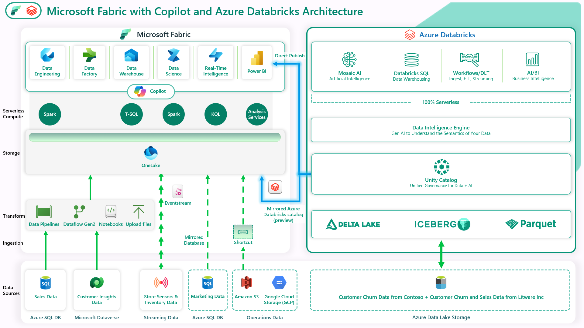

This lab demonstrates how to improve your data workflow using Microsoft Fabric, Copilot, and Azure Databricks. It offers a cost-effective, high-performance, cloud-based solution for analytics. This setup brings together all the customer’s data to help create value faster.

The visual shows an example with Contoso, a fictional retail company with thousands of stores worldwide and an online store. Contoso is acquiring Litware Inc., which has organized marketing and sales data processed using Azure Databricks and stored in the “gold layer” in ADLS Gen2. Contoso also stores its customer churn data in the gold layer in ADLS Gen2. Later, using Dataflow Gen2 and Fabric’s data pipelines, the team employs a “No Code-Low Code” approach to quickly ingest data through Fast Copy and transform it using Copilot. Additionally, by streamlining workflows, Task Flows ensure consistent data ingestion and processing, making data readily available for downstream tasks.

In the following exercises, you'll see how the Contoso team used Microsoft Fabric to pull in data from various sources, merge Litware's data with their own data from ADLS Gen2 and gain valuable insights. You’ll also learn how they used a shortcut to easily access Litware’s data in ADLS Gen2 and how Contoso used Unity Catalog to quickly understand the acquired company’s data. Additionally, Rupesh then leads the team through the Task Flows in Microsoft Fabric, a tool that optimizes their data engineering process making data readily available for downstream tasks. Lastly, you'll explore how they built LLM chatbots using the Databricks Data Intelligence Platform to achieve a new level of market sentiment insights for Contoso. The team explores Eventhouse, using Eventstream to ingest both real-time and historical data into their database, allowing Contoso to monitor current customer interactions alongside historical trends. By analyzing this streaming data with Copilot, they identify important patterns and detect anomalies in real time. These insights empower Contoso to respond quickly to customer needs, boosting satisfaction and engagement.

The lab scenario begins on January 30th. The new CEO, April, has noticed some negative trends in the company’s key metrics, including:

·         High number of customers leaving

·         Falling sales revenue

·         High bounce rate on the website

·         High operating costs

·         Poor customer experience

·         And most importantly, low market sentiment

To address the high customer churn, April and the Contoso team decided to acquire Litware Inc., which carries products popular with millennials. April asks Rupesh, the Chief Data Officer, how they could create a data-driven organization and reverse these adverse KPI trends. Rupesh talks to his technical team, including Eva, the data engineer; Miguel, the data scientist; and Wendy, the business analyst. He tasks them with designing and implementing a solution pattern to realize this vision of a data-driven organization. The team recognizes that the existence of data silos within Contoso's various departments presents a significant integration challenge, which is worsened by the need to combine subsidiary data with data from Litware Inc. To overcome these challenges, they plan to utilize FastCopy for efficient data ingestion, TaskFlow for streamlined workflows, Real-time Intelligence for immediate insights, and Azure SQL DB Mirroring in Fabric to ensure seamless access to relational data across the organization.

During this lab you will execute some of these steps as a part of this team to reverse these adverse KPI trends. First, you will ingest data from a spectrum of data sources into OneLake for Contoso. Let's get started.
 
### Exercise 1: Data Engineering/Data Factory experience - Data ingestion from a spectrum of analytical data sources into OneLake

*Before we start executing the steps, we will open a backup Click-by-Click lab using the following hyperlink in a new tab and navigate back to the VM browser:* 

[Click-by-Click](https://regale.cloud/Microsoft/viewer/3088/modern-analytics-with-microsoft-fabric-copilot-and-azure-databricks-dream-lab-fu/index.html#/0/0)

*Now, let's trigger the Simulator App to start streaming data to EventHub (**to be used later in exercise 4**).*

1. Open a **Microsoft Edge browser** from VM desktop.

2. Click on browser address bar, and click +++https://app-realtime-simulator-@lab.LabInstance.Id.azurewebsites.net+++ to browse app service and press **Enter**.

>**Note**: **Do not click anywhere else on the screen until all of the text has been auto filled.**

3. **IMPORTANT!! PROCEED WITH NEXT STEPS WHILE THIS LOADS. **


	


### Task 1.1: Create a Microsoft Fabric enabled workspace

In this exercise, you will act as the Data Engineer and transfer Contoso's data from Azure SQL Database into the Lakehouse. 

1. Open a new tab. Click on +++**https://app.powerbi.com/**+++ to populate the **Power BI** URL and press **Enter**.

2. Enter the following email by clicking on username +++**@lab.CloudPortalCredential(User1).Username**+++ and click on **Submit**.


3. Enter the password by clicking on +++**@lab.CloudPortalCredential(User1).Password**+++ and click on **Sign in**.


4. If prompted to stay signed in, select **Yes**.


>**Note:** Close any pop-up that appears on the screen.


>**Note:** If you see the following screen, continue with the steps below or directly move to step number 8.

5. Click on the **Continue** button.


6. Click on the **Business phone number box** and type a 10-digit number in the box by clicking on +++1230000849+++. 

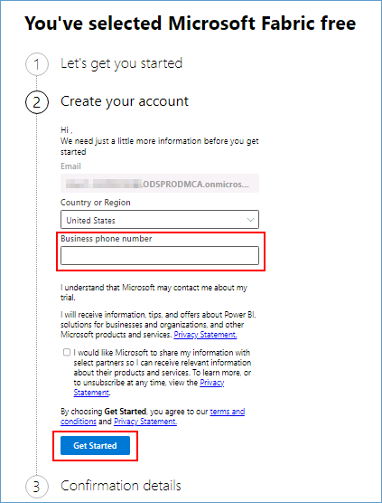

7. Again, click on the **Get Started** button.

	

> **Note:** Wait for the Power BI workspace to load and *close* the top bar for a better view.

<!-- *Close* the top bar for a better view. -->

8. From the left navigation pane, click on **Workspaces** and then the **+ New workspace** button.

	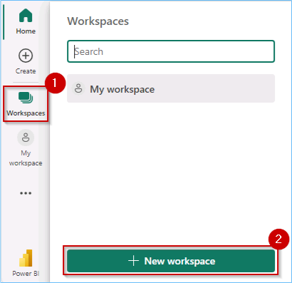

9. Type the name +++**ContosoSales@lab.LabInstance.Id**+++ **validate** the available name and click **Apply**.

>**Note:** Only use the workspace name provided above.

>**NOTE:** If the name **ContosoSales@lab.LabInstance.Id** is already taken, refresh the page and check again. A workspace with that name may already be created. If so, add a different suffix until the name is available.

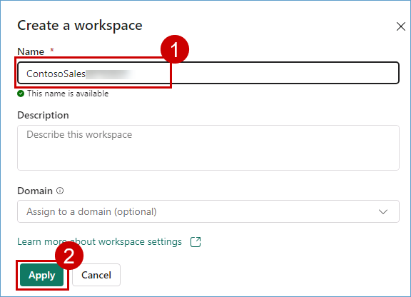

>**Note:** Close any pop-up that appears on the screen.


>**Note:** Wait for the Power BI Workspace to load.


<!-- >**Note**:  If you see the pop message **Upgrade to Power BI Pro License** perform the following steps. Otherwise, skip to the next exercise.

10. *Click on the **Try free** button.*
   

11. *Click on the **Got it** button to continue.*
    -->

<!-- 12. Click on **Workspaces** to verify if the workspace with the given name was created, if not perform the steps above again.

>**NOTE:** If the workspace you created is not visible, perform **step 8** again. -->
<!-- 
 -->


   
<!-- >**Note:** Click on the collapse icon, as shown in the screenshot below, for better visibility.

 -->

### Create/Build a Lakehouse

Now, let's see how each department can easily create a Lakehouse in the Contoso workspace without any provisioning. They simply provide a name, given the proper access rights of course!

1. Click on the **experience** button at the **bottom left** corner of the screen (In this screenshot, **Power BI** is selected as an "Experience") and then select **Data Engineering**.


2. In the new window, under Data Engineering, click **Lakehouse**.


3. Enter the name by clicking on +++**lakehouse**+++.

4. Click the **Create** button.

   

5. View the Lakehouse, SQL endpoint, and default semantic model.

 


---

### Task 1.2: Use the ‘New Shortcut’ option from external data sources

Now, this is something exciting and powerful! This section shows how easy it is to create Shortcuts without actually moving data. That is the power of OneLake! In this exercise, you will ingest the curated bounce rate data for Litware from ADLS Gen2 as an illustration.

1. Click on the **ContosoSales@lab.LabInstance.Id** workspace.


2. Drag the bar up to view the entire list of items.


3. Click on **Filter** and then Select **Lakehouse**.

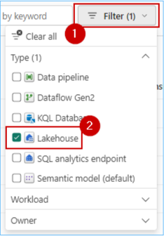

4. Click on the **lakehouse**.

>**Note:** There are 3 options for lakehouse, namely Lakehouse, Semantic model (default) and SQL analytics endpoint. Make sure you select the **Lakehouse** option.


5. Click on the **three dots (ellipses)** on the right side of Files.

6. Click on **New shortcut**.

>**Note:** Make sure you create a shortcut under **files** and not under **tables** in the lakehouse explorer pane.

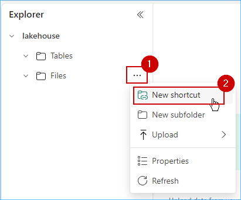


7. In the pop-up window, under **External sources**, select the **Azure Data Lake Storage Gen2** source.


>**Note:** Wait for the screen to load.

8. Select **Create new Connection**
9. In the screen below, we need to enter the connection details for the ADLS Gen2 shortcut.


10. In the **URL** field type the endpoint +++https://stfabricadb@lab.LabInstance.Id.dfs.core.windows.net/+++ , Select **Organization account** for the Authentication Kind, and then Click on **Sign in**

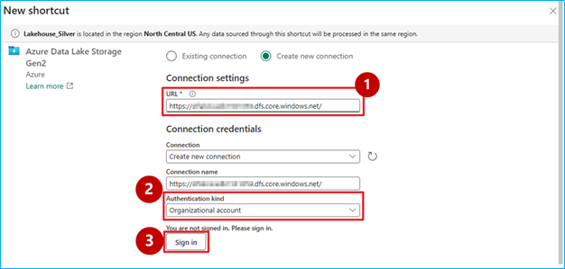

11. Click on your ID to complete the Sign in.


12. Click on **Next** button.


13. Select the **litwaredata** checkbox and then Click on the **Next** button.


14. Click on the **Create** button.


15. And there you go! Your shortcut is now ready! Simply click (do not expand) on the newly created shortcut named **litwaredata**.


### Task 1.3: Create Delta tables using Spark Notebook

1. Click on **Workspace** 


2. Click on **New Item** and then Select **Notebook**


>**Note:**  If Pop-up appears Click on **Skip tour**

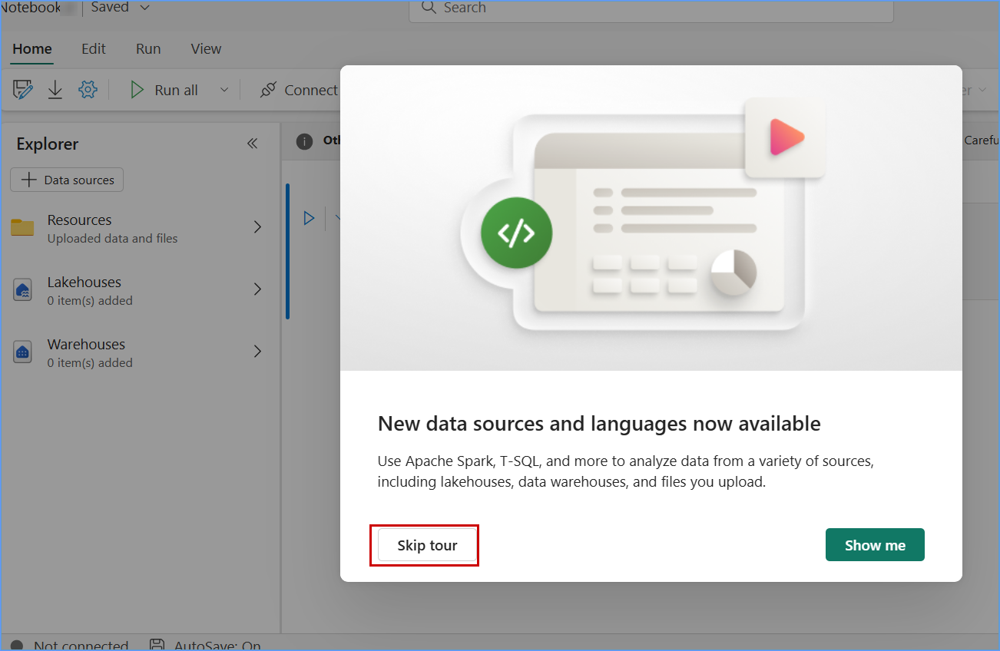

3. Click on **Data Source** and then Select **Lakehouses**


4. Select **Existing Lakehouse** and then Click on ***Add***.


5. Select the **lakehouse** and then Click on **Add**


6. Notebook is Created, now the paste the below code in the cell and **Run** the Notebook.


```
import os
import pandas as pd
 
# List all CSV files in the 'litwaredata' folder
file_path = '/lakehouse/default/Files/litwaredata/'
csv_files = [file for file in os.listdir(file_path) if file.endswith('.csv')]
 
# Load each CSV file into a table
for file in csv_files:
    table_name = file.split('.')[0]
    df = pd.read_csv(file_path + file)
    spark.createDataFrame(df).write.mode("ignore").format("delta").saveAsTable(table_name)
```


7. Once the cell Successfully Completed, Click on **Lakehose**


8. There you go, All the Tables are Loaded Successfully.


19. Click on **website_bounce_rate** delta table and view the website bounce rate data.


20. You now have all the table in **OneLake** for Contoso to leverage. Next, we proceed with data transformation using Dataflow Gen2 to transform the sales data ingested from Litware. 


### Task 1.4: Leverage Dataflow Gen2 and Data pipelines for a "No Code-Low Code" experience to quickly ingest data with Fast Copy and transform it using Copilot

In this exercise, you will experience how easy it is to use fastcopy to transform of Litware's sales data into the lakehouse. 


In this exercise, you will experience how easy it is to use Copilot to transform Litware's sales data into the lakehouse. 

1. Click on the **experience** button at the **bottom left** corner of the screen (In this screenshot, **Data Factory** is selected as an "Experience") and then select **Data Factory**.


2. Click on **Dataflow Gen2**.


3. Click on the top part of the **Get data** icon (**not on the dropdown arrow at the bottom of the icon**).


4. In the pop-up window, scroll down to **OneLake data hub** and click on **lakehouse**.


5. If you see a screen similar to the one shown below, click on the **Next** button.


6. Expand **Lakehouse**, expand **Files** and then expand **litwaredata**. 

7. Select the **sales_data.csv** checkbox, then **click** on the **Create** button.


8. Collapse the **Queries** pane and take a look at the sales dataset (**note that the first row of this dataset is not a header**).

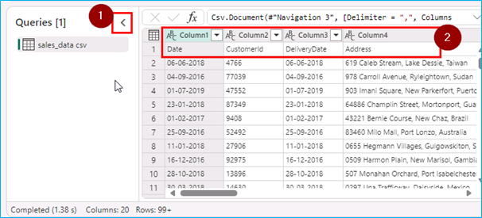

>> **Let's use Copilot to perform data cleansing.**

9. Click on the **Copilot** button, paste the **prompt** provided in the following text box and click on the **send** icon.

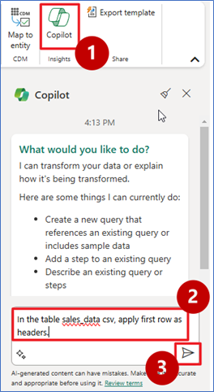

+++In the table sales_data csv, apply first row as headers.+++


>**Note:** If Copilot needs additional context to understand your query, consider rephrasing the prompt to include more details.

10. Scroll to the right hand side and observe the **GrossRevenue** and **NetRevenue** columns (**there are some empty rows with null values**).


>> **Let's use Copilot to remove empty rows.**

11. Similarly, paste the prompt below in Copilot and click on the **send** icon.

+++Remove empty rows from GrossRevenue and NetRevenue columns.+++

12. Scroll to the right hand side and observe the **GrossRevenue** and **NetRevenue** columns (**there are no empty rows with null values**).


>**Note:** Due to time constraints, we will not publish and run the Dataflow from the Pipeline.

>**Note:** If necessary, scroll up to show the close icon.


13. Right click on the query and then select **Requires fast copy**.

  

14. Click on Options, scroll down to Scale and then select **Fast copy**.

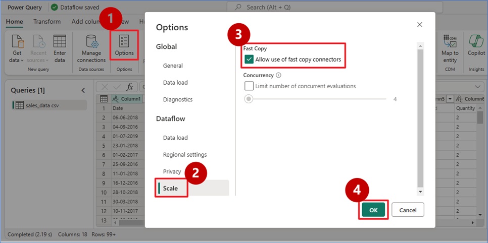 

15. Click on **Add destination**, select **Lakehouse**.

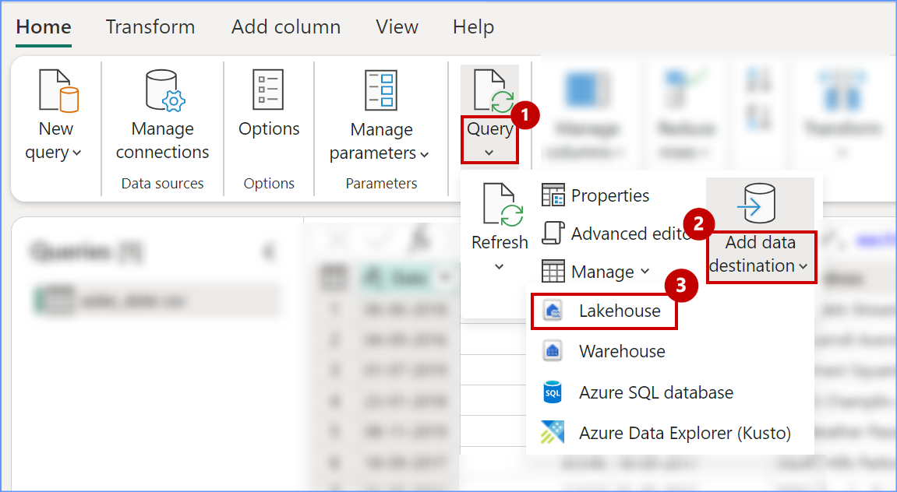 

16. Select the connection and click on **Next** button.

   

17. Select the workspace name(Contoso  ) , then select **lakehouse** and then provide the table name (Sales_100M), click on **Next** button.

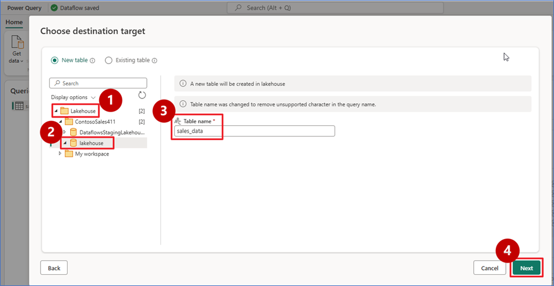 

18. Click on **Save settings**.

 

19. Click on **Publish**.

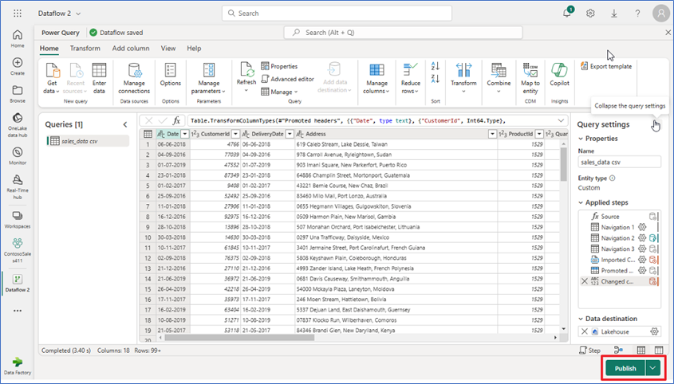

Congrats for completing this data transformation exercise! As you know, Litware was primarily using Azure Databricks with their data stored in ADLS Gen2 before the acquisition. Post merger, as one unified company – Contoso – they decided to leverage Azure Databricks to build and manage reliable data pipelines via Delta Live Tables (DLT). Now, you will see the amazing power of Unity Catalog that Contoso’s data architects used to quickly learn all about Litware's data without having to go through tons of documents. And all by simply leveraging AI and data intelligence.


### Task 1.4: Explore Task Flows in Microsoft Fabric

  1. Click on **Workspace**(Contoso) and drag the **Taskflow** feture tab.
  
  
  
  2.Click on create **Pre-designed Task flow** , 

  

 3. Select **Medallion**, and then click on **Next** button.

  

  4. Task Flow created Successfully.

  


### Exercise 2: DLT Pipelines-Unity Catalog for Data governance, Metastore experience Retrieval Augmented Generation and Machine Learning

### Task 2.1: Explore Delta Live Table pipeline (Data Transformation)

Delta Live Tables (DLT) allow you to build and manage reliable data pipelines that deliver high-quality data in Lakehouse. DLT helps data engineering teams simplify ETL development and management with declarative pipeline development, automatic data testing, and deep visibility for monitoring and recovery.

1. Open a new tab in your browser and sign in to the Azure Databricks Workspace, by clicking on
+++https://@lab.Variable(workspaceurl)+++ and press **ENTER**.

2. Click on the **Sign in with Microsoft Entra ID**.


3. Scroll down in the left navigation pane and click on **Delta Live Table**.


4. Click on the **Create pipeline** button.


5. Enter the name of the pipeline as +++DLT_Pipeline+++ , scroll down to the **Paths** and click on the file icon to browse the notebook.


6. Click on **Shared**.

7. Click on **Analytics with ADB**.

8. Click on the **01 DLT Notebook**.

9. Click on the **Select** button.


10. Click on the **Create** button.


>**Note**: Do not click on the **Start** button. Due to time constraints, We will not be executing this pipeline.


11. If we were to execute it, we would see a result similar to the one in the following screenshot. Click on the screenshot for a better view.


---

### Task 2.2: Explore the data in the Azure Databricks environment with Unity Catalog (unified governance solution for data and AI).

We saw how Contoso utilized DLT pipelines to create a medallion architecture on their data. Now let’s look at how data governance was managed on this curated data across the organization and made easy with Unity Catalog.
 
With the acquisition of Litware Inc., Contoso had a lot of data integration and interoperability challenges. They wanted to make sure that the transition was smooth, and their data engineers and data scientists could easily assimilate the data processed by Databricks. Thankfully, they were able to leverage Gen AI features right within Azure Databricks to understand and derive insights from this data.

>**Note**: Due to time constraints, the following steps will be completed via an online Click-by-Click exercise.
>Please follow the green beacons for this exercise.
- This exercise will be performed outside the VM browser.
- Please return back to the VM browser once you see the **End of Task 2.2** screen.
- Once you press the **Agree** button, press the **A** key on your keyboard if you do not see the annotations.

	
1. Click on the [**hyperlink**](https://regale.cloud/Microsoft/viewer/3066/task-22-explore-the-data-in-azure-databricks-environment-with-unity-catalog/index.html#/0/1)

2. Continue with next excercise.

### Task 2.3:Create mirrored Azure Databricks catalog in Fabric and analyze data using T-SQL] (#task-23-Create mirrored Azure Databricks catalog in Fabric and analyze data using T-SQL)

Mirroring Azure Databricks catalog structure to Fabric enables the access of the underlying catalog data through shortcuts. Hence any changes in data are reflected immediately in Fabric. There is no data movement or data replication.

1. Navigate to the Microsoft Fabric tab on your browser (https://app.fabric.microsoft.com).

2. Click on your **Workspace**, and select **New item** from menu bar.


3. In the **New item** window, scroll down and click on **Microsoft Azure Databricks catalog (preview)**.


4. **New source** window pops up, and click on **Create new connection** radio button.


5. Now, got to https://portal.azure.com/#home and select **Azure Databricks** from available Azure services.


6. Select your Azure Databricks Service.


7. Under Overview tab, copy the **URL** detail as shown in the image.


8. Now, go back to your Microsoft Fabric tab and fill in the **URL**, select **Service principal** from 'Authentication kind' dropdown box, paste **Tenant ID**, **Service principal client ID**, **Service principal Key** from <enter source information> and click on **Connect** button.

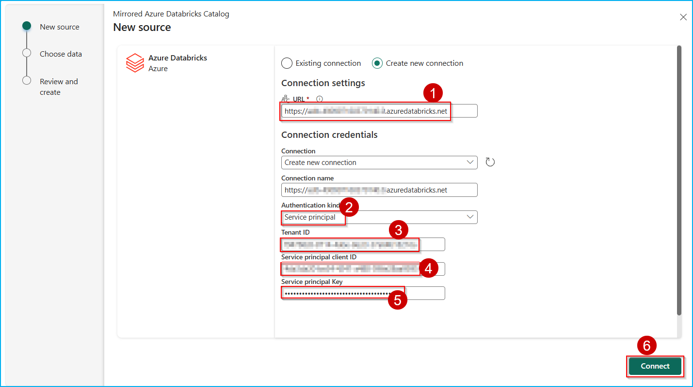

9. Click on **Next** button.


10. In the **Choose data** screen, select the **Catalog name** from the dropdown box, and select the tables to be mirrored into Fabric, then select the checkbox **Automatically sync future catalog changes for the selected schema** to mirror future tables and click on **Next** button.


11. Enter the **Artifact name** for your mirrored Databricks Catalog and click on **Create** button.


12. Click on **Monitor catalog** button to track the mirroring status.


13. Click on the **View SQL endpoint** button. You can also select the tables to preview data.


### Exercise 3: Power BI Experience in Fabric
 
### Task 3.1: Create a Semantic model and generate insights using Copilot for Power BI

With the wide spectrum of data sources and Litware's data in OneLake, it is now time to get some awesome insights and visualizations from this data. Let's dive deep into the experience of the Business Analyst, Wendy, and do just that. Based on all the gathered data, Wendy is expected to create Power BI reports for other data citizens and stakeholders. Let's step into her shoes to experience the power of Copilot for Power BI in conjunction with Direct Lake Mode.

** Navigate back to the Microsoft Fabric tab on your browser.**

1. Click on **Workspaces** and select **ContosoSales@lab.LabInstance.Id**.


2. Click on **Filter** and select **Lakehouse**.


3. Click on the **lakehouse**.

>**Note:** There are 3 options for lakehouse, namely Lakehouse, Semantic model(Default) and SQL endpoint. Make sure you select the **Lakehouse** option.

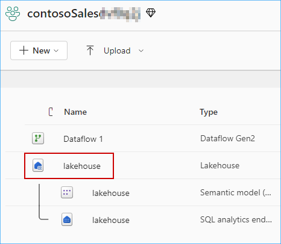

4. Click on the **New semantic model** button. 


5. In the Name field enter +++website_bounce_rate_model+++.

6. Select workspace as **ContosoSales@lab.LabInstance.Id** and click on expand icon next to **dbo** checkbox.


7. Click on expand icon next to **Tables** checkbox.

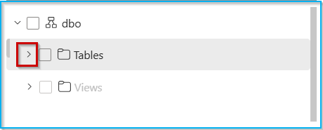

8. Scroll down if you see a scroll bar and select **website_bounce_rate** table and click on the **Confirm** button. 


>Wait for the semantic model creation.

9. To create a new report using this semantic model, click on **New Report** in the top bar.
 


10. Click on **Settings** icon and select **Power BI settings** from the 'Resources and extensions' section.


11. Select **Semantic models** tab and select your Semantic model.


12. Scroll down to **Q&A** section, select **Turn on Q&A to ask natural language questions about your data** checkbox, and click on **Apply**.


13. Click on the **Copilot** icon and collapse the other panes for Filters, Visualizations and Data.

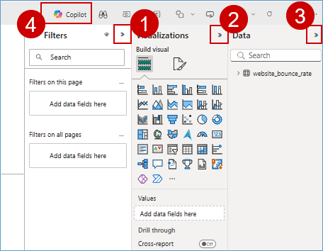

>**Note:** Close any pop-up that appears on the screen.

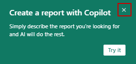

14. Click on **Preview** button to the right side to enable it.

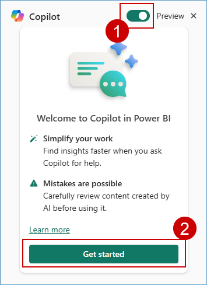

15. You will now see how easy it is for the data analyst to create compelling Power BI reports and get deep insights with literally no hands-on coding!
	
16. Click on the **Prompt Guide** button.

  

17. Select the option **What's in my data?**

 > **Note:** If you don't see the 'What's in my data?' option, click in the **Copilot chat box** field, enter the prompt below, and click the **Send** button: 
+++What's in my data?+++


The first option, 'What’s in my data?' provides an overview of the contents of the dataset, identifies and describes what’s in it and what the attributes are about. So, there’s no need to wait for someone to explain the dataset. This improves the efficiency and volume of report creation.


18. Click in the Copilot chat box field and enter the prompt below.

+++Create a report Bounce Rate analysis, to show the correlation between customer sentiment, particularly among millennials and Gen Z, unsuccessful product searches across different devices, and the website's bounce rate by customer generations.+++  

>**Note:** Wait for the prompt to populate.

19. Click on the **Send** button and wait for the results to load. 


	
>**Note:** If you see the error message saying, 'Something went wrong.', try refreshing the page and restart the task. Being in a shared environment, the service may be busy at times.
- If Copilot needs additional context to understand your query, consider rephrasing the prompt to include more details

>**Note:** The responses from Copilot may not match the ones in the screenshot but will provide a similar response.


Based on this report, we notice that the website bounce rate for Contoso is especially high amongst the Millennial customer segment. Let’s ask Copilot if it has any recommendations for improving this bounce rate based on the results and data in the report.

We’ll ask Copilot for suggestions based on the results and data in the report. 

20. Enter the following prompt in Copilot, 

+++Based on the data in the page, what can be done to improve the bounce rate of millennials?+++ 

and press the **Send** button.
	

	
21. Look at the suggestions Copilot provided. Copilot creates the desired Power BI report and even goes a step further to give powerful insights. Wendy realizes that for the website bounce rate to improve, Contoso needs to transform their mobile website experience for millennials. This helps them reduce their millennial related customer churn too! Now, what if Contoso’s leadership team needed a quick summary of this entire report? **Smart Narrative** to the rescue! 
	

	
22. Expand the **Visualizations** pane and select the **Narratives** visual. 


23. Click on **Copilot (preview)** within the visual.


	
24. Select **Give an executive summary**. 

25. Click on **Update** and observe the generated summary. See how easy it was to get an executive summary with absolutely no IT resource dependency!
 
> **Note:** If you don't see 'Give an executive summary' option, click in the Copilot narrative chat box field, enter the prompt below, and click on **Update** :
+++Summarize the data, provide an executive summary, indicating important takeaways.+++


26. Expand the narrative from the corner to get a better readable view of the result.


27. Click on the **Close** button in the pop-up window.


	
The summary could also be generated in another language if specified. Additionally, the summary updates if you filter the report on any visual.


### Exercise 4: Real-time Intelligence experience - Explore Streaming data using Copilot for KQL DB

Imagine, it is 6 am on the day of Contoso's big Thanksgiving sale. Customers are flocking to their stores in large numbers. We are about to witness the very culmination of Contoso's phenomenal transformation with Microsoft Fabric and Azure Databricks. Specifically, we will see how near real-time data is used to make decisions for the next moment in Contoso's stores to ensure optimal temperatures are maintained for their customers while they shop at the big sale!

### Task 4.1: Ingest real-time/historical data into Eventhouse using Eventstream

1. Click on the **experience** button at the **bottom left** corner of the screen (In this screenshot, **Data Factory** is selected as an "Experience") and then select **Real-Time Intelligence**.


>**Note:** If you see a pop-up like the one below, click on the **Don't save** button.

 

2. On the Real-Time Intelligence experience screen, click on **Eventhouse**.


3. Enter the name +++Contoso-Eventhouse+++.

4. Click on the **Create** button and wait for the database to be created.


>**Note:** If you see a pop-up like the one in the screenshot below, ignore it and proceed with the next step.


5. Click on the **experience** button at the **bottom left** corner of the screen (In this screenshot, **Real-Time Intelligence** is selected as an "Experience") and then select **Real-Time Intelligence**.


6. Select **Eventstream**.


7. Enter the name as +++RealtimeDataTo-KQL-DB+++ and tick a checkbox 'Enhanced Capabilities(preview)' then click on **Create** button.


8. Click on the **Add external source** button.


9. Click on the **Azure Event Hub** button.

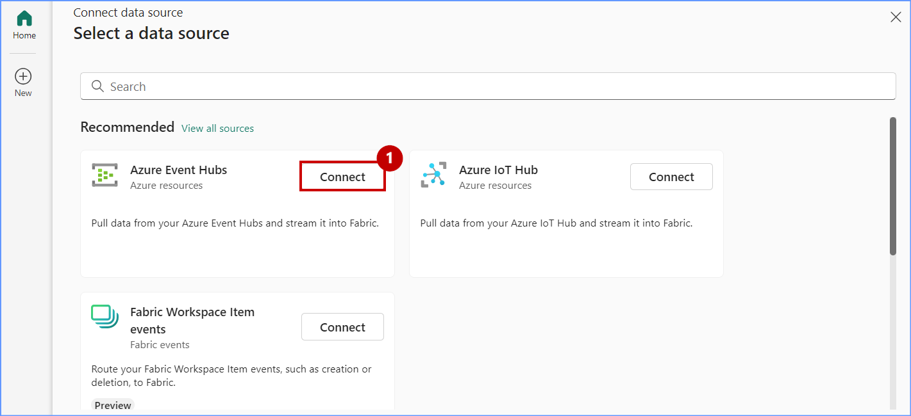

10. Under the Connection field, click on **New connection**.

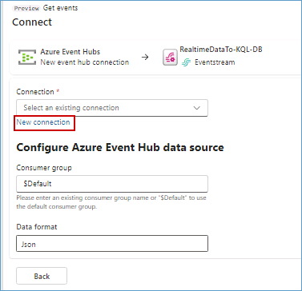

11. Enter the value for the **Event Hub namespace** as +++evh-thermostat-@lab.LabInstance.Id+++ and enter the **Event Hub** value as +++thermostat+++.


12. Scroll down and select **Shared Access Key** for Authentication kind, enter the Shared Access Key Name as +++thermostat+++ and then Enter the value +++@lab.Variable(EventHubKey)+++ in the **Shared Access Key** and then click on the **Connect** button.

>**Note:** Close any pop-up that appears on the screen.


>**Note:** Close any pop-up which appears on screen.


13. Select Data format as **JSON** and click on **Next** button.


>**Note:** Wait for the connection to be established.

14. Click on the **Add** button.


15. In the Eventstream canvas, click on the **Add destination** dropdown and select **KQL Database**.


16. Select the **Event processing before ingestion** radio button, enter +++RealTimeData+++ as the Destination name.

17. In the **Workspace** field select **ContosoSales@lab.LabInstance.Id**. 

18. In the **Eventhouse** dropdown select **Contoso-Eventhouse**.

18. In the **KQL Database** dropdown select **Contoso-Eventhouse**.

19. Click on the **Create new** button.


20. Enter the table name as +++thermostat+++ and then click on the **Done** button.


21. Enter the Input data format as **Json**.

>**Note:** Zoom-out on your screen if the Input data format field is not visible.


22. Drag Arrow from 'RealtimeDataTo-KQL' and connect it to 'RealTimeData'.


23. Click on the **Publish** button.


>**Note:** Wait for the data ingestion from EventHub to KQL DB.

24. Once you see that the streaming has started, click on **Refresh** and wait for the data to preview.


Real-time data from the event hub has been ingested successfully into the KQL Database. Next, as customers walk in aisles and the temperatures fluctuate, let us see how KQL queries proactively identify anomalies and help maintain an optimal shopping experience!

---

### Task 4.2: Analyze/discover patterns, identify anomalies and outliers using Copilot

Kusto Query Language is a powerful tool. In this scenario KQL is used to explore Contoso’s data, discover patterns, identify anomalies and outliers, create statistical modeling, and more.

We use KQL to query the thermostat data that’s streaming in near real-time from the devices installed in Contoso’s stores.

1. Click on **Workspaces** and select **ContosoSales@lab.LabInstance.Id** workspace from the left navigation pane.


2. Click on the **experience** button at the **bottom left** corner of the screen (In this screenshot, **Real-Time Intelligence** is selected as an "Experience") and then select **Real-Time Intelligence**.


3. Select **KQL Queryset**.


4. In the KQL Queryset name field, +++Query Thermostat Data in Near Real-time using KQL Script+++ and click on the **Create** button.


5. **Wait** for the query set creation and a new screen will display. In this screen, click on **Contoso-Eventhouse**, verify the workspace name and then click on the **Connect** button.


6. Place your cursor inside the **query** field, select all using **Ctrl + A** and **delete** the pre-written query.


7. Click on the **Copilot** button.


8. **Paste** the query provided below in the Copilot query section.

+++Create a query to summarize average temperature every 1 min in line chart+++

9. Click on the **Send** icon.

>**Note:** The responses from Copilot may not match the ones in the screenshot but will provide a similar response. 

10. Click on the **Insert** button.


11. Place you cursor in the **script field**, click on the **Run** button and you get the desired result.


So, imagine if one of the aisles had a sudden rise in temperature. Customers start leaving that aisle and the wait times in the checkout lines start to increase. But thanks to the KQL Queries, those anomalies would be tracked, and immedia/labMediate notifications would be generated to bring the aisle temperature back to optimal levels! Now, after all these amazing data transformations in OneLake in a healthy ecosystem with Azure Databricks, can we actually predict customer churn for the future? Absolutely! In fact, in the next exercise, let’s see the power of Microsoft Fabric and Azure Databricks to do just that!


### Exercise 5: Explorer Data Science experience in Microsoft Fabric (Optional)
 
Microsoft Fabric offers Data Science experiences to empower users to complete end-to-end data science workflows for data enrichment and business insights.

You can complete a wide range of activities across the entire data science process, all the way from data exploration, preparation and cleansing to experimentation, modeling, model scoring and serving predictive insights to BI reports.

### Task 5.1: Build ML models and experiments using Copilot in Fabric

   

To understand the cause behind Contoso’s declining revenue, the team needed to dive deeper into their customers’ spending pattern. 

Copilot responds to queries in natural language or generates customized code snippets for tasks like creating charts, filtering data, applying transformations, and building machine learning models.

Let’s see how copilot for notebook helped you to quickly create data science notebooks.

1. Switch to the **Data Science** experience using the experience switcher icon in the left corner.

   

2. Click on Import notebook.

   

3. Click on the **Upload** button.

   

4. Browse to the fabricnotebooks folder in your VM and select **Build ML models and experiments using Copilot for Data Science in Fabric** notebook.

5. Click on the **Open** button.

   

6. Wait for the notebook to **upload**.

   

7. Click on the **ContosoSales...** workspace from the left navigation pane.

   

8. Click on **Filter** and select **Notebook**.

   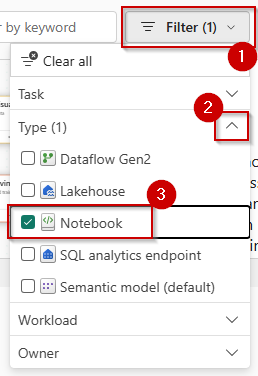

9. Click on the **Build ML models and experiments using Copilot for Data Science in Fabric** notebook.

   

10. Click on **Lakehouses** in the Explorer pane.

   

11. Click on **Missing Lakehouses** and then click on **Remove all Lakehouse**.

   

12. Click on the **Continue** button.

     

13. Click on the **+ Lakehouse** button.

    

14. Make sure that **Existing Lakehouse** radio button is selected and then click on the **Add** button.

   

15. Select the **lakehouse** checkbox.

   

16. Click on the **Add** button.

   

17. Click on the **Copilot** button and then click on the **Get Started** button.

   

18. Run the **first cell** of the notebook to install the copilot packages.

>**Note:** This may take a while to execute, please wait till this load completely.

   

19. Copy and paste the **below prompt** in the textbox.

```
Load the "customerchurndata" table from the lakehouse into a Spark DataFrame. Then convert that into pandas dataframe as df
```

20. Click on the **send** button.

   

21. Click on the **Copy code** icon.

>**Note:** The new cell will be created right above the cell.

   

22. Click on a **+ Code** above the first cell of the notebook.

   

22. Paste the **copied query** and run the new **cell**.

   

23. Paste the following at the **end of your browser URL** and press the **Enter** key. 

```
&debug.enableCopilot=1&debug.enableChatWidget=1&debug.enableQuickAssist=1
```

   

25. Click on a **+ Code** above the cell and click on the **Copilot** button.

   

26. Enter the below prompt in the Copilot textbox: 

```
Create a pivot table of average with min and max total amount by store contract and churn. Then show output of the pivot table.
```

27. Click on the **Send** icon.

   

28.	Click on the Accept button.

   

29. Run the cell and observe the output.

   

30. Add a **new code cell** to the notebook, paste following **query** to the cell and then run the **cell**.

```
%%chat 
Create a seaborn scatterplot with Tenure Total Amount and Churn
```

   

18.	Introduce an error in a previous cell by removing a character in the code.

19.	Run the code cell with the error.

20.	Click on fix with copilot.

   

With prepared data and with the help of copilot as we just saw, you may explore the data to understand the patterns it contained.

21. Go back to the Data Science experience and click on Import notebook.

   

22. Select **02 Churn Prediction using MLFlow** notebook.

>**Note:** The steps given here are for demo purposes only. Users are requested not to create /edit/ update/run anything in the notebooks.

23. Point to Exploratory Data Analysis.

   

24. Point to Feature Correlation Plot.

   

25. Point to Build and ML model.

   

26. Point to Build Final Model.

   

27. Point to Log ML model.

   

28. Point to Run batch scoring on spark with scalable PREDICT UDF.

   

29. Point to Store Prediction in the Lakehouse.

   


### Task 5.2: Leverage AI skills for Q&A

1. From the left navigation pane select **Data Science** experience.


2. Click on **>** Forward Arrow and select **AI Skill**.

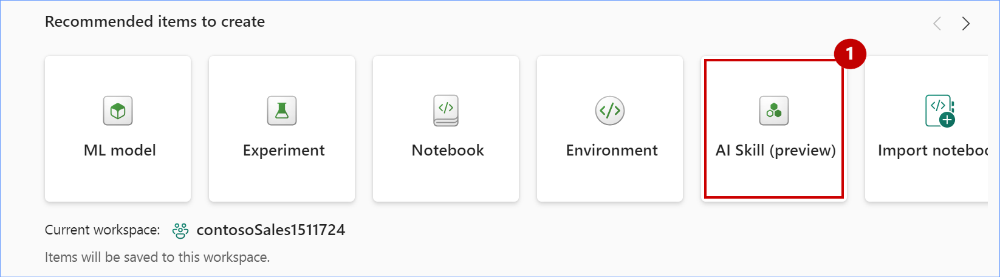

3. Enter Name as **Contoso-Assistance** 


4. Click on **Lakehouse** and select it.


5. Click on **refresh** and Expand **Tables** then select the following tables.

- dimcustomer
- dimdate
- dimdateupdated
- dimproduct
- dimreseller
- factinternetsales
- factresellersales


6. Click on **Get Started**.


8. Type **What is the most sold product?** in the chatbox and click on **Send** button.


9. AI Skill answered the question fairly well based on the selected tables.
However, the SQL query needs some improvement, it orders the products by order quantity, when total sales revenue associated with the product is the most important consideration, as shown in the above screenshot.
To improve the query generation, let's provide some instructions, as shown in these examples:

``Whenever I ask about "the most sold" products or items, the metric of interest is total sales revenue and not order quantity.``

``The primary table to use is FactInternetSales. Only use FactResellerSales if explicitly asked about resales or when asked about total sales.``

10. Copy the above notes and paste it in **Notes for model** box. Type **What is the most sold product?** in the chatbox and click on **Send** button.  

Asking the question again returns a different answer, **Mountain-200 Black, 46**, as shown in the below screenshot:


In addition to instructions, examples serve as another effective way to guide the AI. If you have questions that your AI skill often receives, or questions that require complex joins.

11. In the example SQL queries click on **edit** icon.


12. Click on **+Add example** and enter the following question and their respective SQL queries.

|Question| SQL query|
|--------|----------|
|who are the top 5 customers by total sales amount?|SELECT TOP 5 CONCAT(dc.FirstName, ' ', dc.LastName) AS CustomerName, SUM(fis.SalesAmount) AS TotalSpent FROM factinternetsales fis JOIN dimcustomer dc ON fis.CustomerKey = dc.CustomerKey GROUP BY CONCAT(dc.FirstName, ' ', dc.LastName) ORDER BY TotalSpent DESC;|
|what is the total sales amount by year?|SELECT dd.CalendarYear, SUM(fis.SalesAmount) AS TotalSales FROM factinternetsales fis JOIN dimdate dd ON fis.OrderDateKey = dd.DateKey GROUP BY dd.CalendarYear ORDER BY dd.CalendarYear;|


13. Click on **close(X)** button.


14. Type **who are the top 5 customers by total sales amount?** in the chatbox and click on **Send** button.


15. Click on **Publish**.


16. In the pop-up screen click on **Publish**.


17. Notice that AI skill is published successfully.

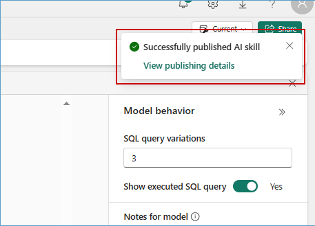

### Exercise 6: Mirroring Azure SQL DB Experience

### Task 6.1: Create Azure SQL DB Mirroring in Fabric

Mirroring in Fabric provides an easy experience to avoid complex ETL (Extract Transform Load) and integrate your existing Azure SQL Database estate with the rest of your data in Microsoft Fabric.

1. Navigate to the Microsoft Fabric tab on your browser (https://app.fabric.microsoft.com).

2. Click on your workspace, and select **New item** from menu bar.


3. In the **New item** window, scroll down and click on **Microsoft Azure SQL Database (preview)**.


4. When prompted to **Choose a database connection to get started**, look for **New sources** and select **Azure SQL database**.


5. You will see the **Connection settings** screen as below.


6. Now, got to https://portal.azure.com/#home and select **SQL databases** from available Azure services.


7. Select your SQL database.


8. Under Overview tab, copy the **Server name** and **Database name** details as shown in the image.


9.  Scroll down and select **Basic** for Authentication kind, enter +++labsqladmin+++ as the Username, +++Smoothie@2024+++ as the Password and click on the **Next** button.


>**Note:** Close any pop-up that you see throughout the lab.

10. In the **Choose data** screen, you can select the tables to be mirrored into Fabric, then select the checkbox **Automatically mirror future tables** and click on **Connect** button.


11. Enter the name for your mirrored db and click on **Create mirrored database** button.


12. Click on **Monitor replication** button to track the replication status.


13. Wait until the **Rows replicated** statistics are displayed. Now, Azure SQL DB has been successfully mirrored.


14. Close the **Monitor replication** window.

---

### Task 6.2: Analyze the mirrored Azure SQL Database data using T-SQL

Each mirrored Azure SQL database has an autogenerated SQL analytics endpoint that provides a rich analytical experience on top of the tables created by the mirroring process.

1. Continuing from the priously created Mirrored SQL DB window, select **SQL analytics endpoint** from top right dropdown box.


2. You can select the mirrored tables to see data preview. Click on **New SQL query** button from the menu bar.

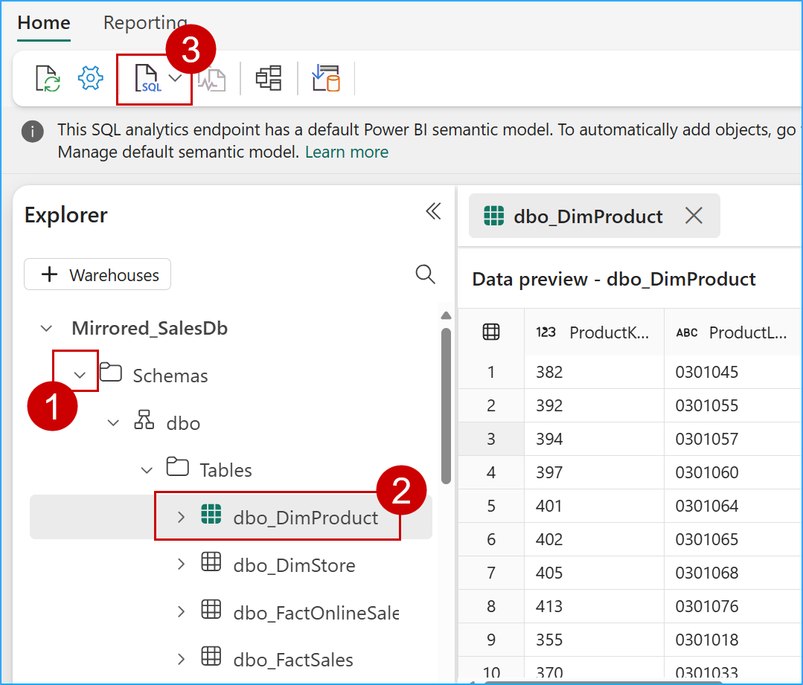

3. Copy below **SQL query** in query editor to explore mirrored data and perform your analysis. +++Select distinct [ProductName] from [SalesDb].[dbo].[dbo_FactSales] as fct
left join [SalesDb].[dbo].[dbo_DimProduct] as prd
on fct.[ProductKey]=prd.[ProductKey]
where [SalesAmount] > 6000+++

 

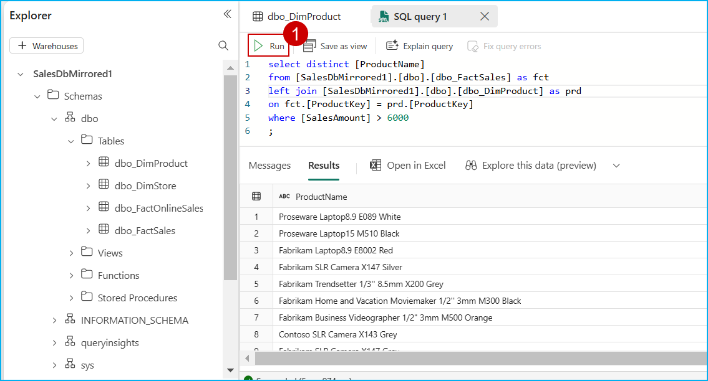

---

Congratulations! You as Data Engineers have helped Contoso gain actionable insights from its disparate data sources, thereby contributing to future growth, customer satisfaction, and a competitive advantage.

In this lab we experienced the creation of a simple integrated, open and governed Data Lakehouse foundation using Modern Analytics with Microsoft Fabric and Azure Databricks.

In this lab we covered the following:

First, we explored the Data Engineering experience and learned how to create a Microsoft Fabric enabled workspace, build a Lakehouse, and ingest data into OneLake along with other data engineering operations with dataflow copilot.

Second, we explored an analytics pipeline using open Delta format and Azure Databricks Delta Live Tables to build a simple Lakehouse and integrate with OneLake with shortcuts.

Third, we explored data governance and generative AI features in Azure Databricks with Unity Catalog. We also explored ML and BI scenarios on the Lakehouse. Here we reviewed MLOps pipeline using the Azure Databricks managed MLflow with Azure ML.

Fourth, we saw the Power BI experience in Fabric with copilot and direct lake mode.

Fifth, we explored Streaming data using KQL DB for a Real-time Analytics experience. Here, we created a KQL Database, ingested real-time and historical data into KQL DB, analyzed patterns to uncover anomalies and outliers with the help of copilot.

Finally, we leveraged Power BI to derive actionable insights from data in the Lakehouse using Direct Lake mode.
