# Replacement Tokens & Values

* Storage Account Key: `@lab.Variable(storageaccountkey)`
* SQL Endpoint: `@lab.Variable(sqlEndpoint)`
* Destination URI: `@lab.Variable(destinationUri)`
* Workspace URL: `@lab.Variable(workspaceurl)`
* Event Hub key: `@lab.Variable(EventHubKey)`

# Lab423: Elevate your data workflow with Microsoft Fabric, Copilot and Azure Databricks DREAM Lab
**The estimated time to complete this lab is 50-60 minutes.**

**DISCLAIMER**

This presentation, demonstration, and demonstration model are for informational purposes only and (1) are not subject to SOC 1 and SOC 2 compliance audits, and (2) are not designed, intended or made available as a medical device(s) or as a substitute for professional medical advice, diagnosis, treatment or judgment. Microsoft makes no warranties, express or implied, in this presentation, demonstration, and demonstration model. Nothing in this presentation, demonstration, or demonstration model modifies any of the terms and conditions of Microsoft’s written and signed agreements. This is not an offer and applicable terms and the information provided are subject to revision and may be changed at any time by Microsoft.

This presentation, demonstration, and demonstration model do not give you or your organization any license to any patents, trademarks, copyrights, or other intellectual property covering the subject matter in this presentation, demonstration, and demonstration model.

The information contained in this presentation, demonstration and demonstration model represents the current view of Microsoft on the issues discussed as of the date of presentation and/or demonstration, for the duration of your access to the demonstration model. Because Microsoft must respond to changing market conditions, it should not be interpreted to be a commitment on the part of Microsoft, and Microsoft cannot guarantee the accuracy of any information presented after the date of presentation and/or demonstration and for the duration of your access to the demonstration model.

No Microsoft technology, nor any of its component technologies, including the demonstration model, is intended or made available as a substitute for the professional advice, opinion, or judgment of (1) a certified financial services professional, or (2) a certified medical professional. Partners or customers are responsible for ensuring the regulatory compliance of any solution they build using Microsoft technologies.

**Copyright**

© 2024 Microsoft Corporation. All rights reserved. 

By using this demo/lab, you agree to the following terms:

The technology/functionality described in this demo/lab is provided by Microsoft Corporation for purposes of obtaining your feedback and to provide you with a learning experience. You may only use the demo/lab to evaluate such technology features and functionality and provide feedback to Microsoft. You may not use it for any other purpose. You may not modify, copy, distribute, transmit, display, perform, reproduce, publish, license, create derivative works from, transfer, or sell this demo/lab or any portion thereof.

COPYING OR REPRODUCTION OF THE DEMO/LAB (OR ANY PORTION OF IT) TO ANY OTHER SERVER OR LOCATION FOR FURTHER REPRODUCTION OR REDISTRIBUTION IS EXPRESSLY PROHIBITED.

THIS DEMO/LAB PROVIDES CERTAIN SOFTWARE TECHNOLOGY/PRODUCT FEATURES AND FUNCTIONALITY, INCLUDING POTENTIAL NEW FEATURES AND CONCEPTS, IN A SIMULATED ENVIRONMENT WITHOUT COMPLEX SET-UP OR INSTALLATION FOR THE PURPOSE DESCRIBED ABOVE. THE TECHNOLOGY/CONCEPTS REPRESENTED IN THIS DEMO/LAB MAY NOT REPRESENT FULL FEATURE FUNCTIONALITY AND MAY NOT WORK THE WAY A FINAL VERSION MAY WORK. WE ALSO MAY NOT RELEASE A FINAL VERSION OF SUCH FEATURES OR CONCEPTS. YOUR EXPERIENCE WITH USING SUCH FEATURES AND FUNCITONALITY IN A PHYSICAL ENVIRONMENT MAY ALSO BE DIFFERENT.

## Table of Contents
 
## Table of Contents
 
## Exercise 1: Data Engineering/Data Factory experience - Data ingestion from a spectrum of analytical data sources into OneLake
 
 - Task 1.1: Create a Microsoft Fabric enabled workspace
 - Task 1.2: Use the ‘New Shortcut’ option from external data sources
 - Task 1.3: Use Leverage Dataflow Gen2 and data pipelines for a "No Code-Low Code" experience to quickly ingest data with Fast Copy and transform it using Copilot.
 - Task 1.4: Explorer Task Flows in Microsoft Fabric

## Exercise 2: Azure Databricks integration with Fabric: DLT Pipelines, Unity Catalog (Data governance), Mirrored Azure Databricks Catalog 
 - Task 2.1: Create Delta Live Table pipeline (For Data Transformation) 
 - Task 2.2: Explore the data in the Azure Databricks environment with Unity Catalog(unified governance solution for data and AI)
 - Task 2.3: Create mirrored Azure Databricks catalog in Fabric and analyze data using T-SQL

 
## Exercise 3: Power BI Experience in Fabric
 
- Task 3.1: Create a Semantic model and generate insights using Copilot for Power BI

## Exercise 4: Real-time Intelligence experience - Explore Streaming data using Copilot for KQL DB
 
- Task 4.1: Ingest real-time/historical data into Eventhouse using Eventstream
 
- Task 4.2: Analyze/discover patterns, identify anomalies and outliers using Copilot

## Exercise 5: Explorer Data Science experience in Microsoft Fabric (Optional)
 
- Task 5.1: Build ML models and experiments using Copilot in Fabric
- Task 5.2: Leverage AI skills for Q&A 

## Exercise 6:  Datawarehouse Experience (Optional)
- Task 6.1: Create Azure SQL DB Mirroring in Fabric
- Task 6.2: Analyze the mirrored Azure SQL Database data using T-SQL

## Overview

This lab showcases Modern Analytics with Microsoft Fabric and Azure Databricks, featuring a cost-effective, performance-optimized, and cloud-native Analytics solution pattern. This architecture unifies our customers' data estate to accelerate data value creation. 

The visual illustrates the real-world example for Contoso, a fictitious company. 
Contoso is a retailer with thousands of brick-and-mortar stores across the world and an online store. Contoso is acquiring Litware Inc. which has curated marketing data and sales data processed by Azure Databricks and stored in the gold layer in ADLS Gen2. Contoso also has their customer churn data stored in the gold layer in ADLS Gen2. 

In the following exercises, you will see how the Contoso team leveraged the power of Microsoft Fabric to ingest data from a spectrum of sources, combine Litware's data with their existing data from ADLS Gen2, and derive meaningful insights. Witness how they used a shortcut to reference Litware’s existing data from ADLS Gen2. Finally, you will see how Contoso’s data architects utilized Unity Catalog to quickly get up to speed on the acquired company’s data. You will also see the power of creating LLM Chatbots with the Databricks Data Intelligence Platform to achieve an unprecedented market sentiment for Contoso.

The lab scenario starts on January 30th. The company's new CEO, April, noticed negative trends in their KPIs, including:

- High customer churn

- Declining sales revenue

- High bounce rate on their website

- High operating expense

- Poor customer experience
  
- And most importantly, a low Market Sentiment

To address the high customer churn, April and the Contoso team decided to acquire Litware Inc., which carries products popular with millennials. April asks Rupesh, the Chief Data Officer, how they could create a data driven organization and reverse these adverse KPI trends. Rupesh talks to his technical team, including Eva, the data engineer, Miguel, the data scientist and Wendy, the business analyst. Rupesh tasks them with designing and implementing a solution pattern to realize this dream of a data driven organization. They recognize that the existence of data silos within Contoso's various departments presents a significant integration challenge. This challenge is worsened by the need to combine its subsidiary data and data from Litware Inc.

During this lab you will execute some of these steps as a part of this team to reverse these adverse KPI trends. First, you will ingest data from a spectrum of data sources into OneLake for Contoso. Let's get started.

===

**Table of Contents**
 
1. **[Exercise 1: Data Engineering/Data Factory experience - Data ingestion from a spectrum of analytical data sources into OneLake](#exercise-1-data-engineering-Data Factory experience - Data ingestion from a spectrum of analytical data sources into OneLake)**

 	- [Task 1.1: Create a Microsoft Fabric enabled workspace’]
	(#task-11-Create a Microsoft Fabric enabled workspace')

 	- [Task 1.2: Use the ‘New Shortcut’ option from external data sources]
	(#task-12-Use the ‘New Shortcut’ option from external data sources)

 	- [Task 1.3: Use Leverage Dataflow Gen2 and data pipelines for a "No Code-Low Code" experience to quickly ingest data with Fast Copy and transform it using Copilot]
	(#task-13-Use Leverage Dataflow Gen2 and data pipelines for a "No Code-Low Code" experience to quickly ingest data with Fast Copy and transform it using Copilot)
	- [Task 1.4: Explorer Task Flows in Microsoft Fabric]
	(#task-14-Explorer Task Flows in Microsoft Fabric)
 

2. [Exercise 2: Azure Databricks integration with Fabric: DLT Pipelines, Unity Catalog (Data governance), Mirrored Azure Databricks Catalog](#exercise-2-: Azure Databricks integration with Fabric: DLT Pipelines, Unity Catalog (Data governance), Mirrored Azure Databricks Catalog)

	- [Task 2.1: Create Delta Live Table pipeline (For Data Transformation)]	(#task-21-Create Delta Live Table pipeline (For Data Transformation))

	- [Task 2.2: Explore the data in the Azure Databricks environment with Unity Catalog(unified governance solution for data and AI)]	(#task-22-Explore the data in the Azure Databricks environment with Unity Catalog(unified governance solution for data and AI))
	
	- [Task 2.3: Create mirrored Azure Databricks catalog in Fabric and analyze data using T-SQL]
	(#task-23-Create mirrored Azure Databricks catalog in Fabric and analyze data using T-SQL)

3. [Exercise 3: Power BI Experience in Fabric]
(#exercise-3-Power BI Experience in Fabric)
	- [Task 3.1: Create a Semantic model and generate insights using Copilot for Power BI in Microsoft Fabric]
	(#task-31-create-a-semantic-model-and-generate-insights-using-copilot-for-power-bi-in-microsoft-fabric)

4. [Exercise 4: Real-time Intelligence experience - Explore Streaming data using Copilot for KQL DB](#exercise-4-real-time-analytics-experience-explore-streaming-data-using-copilot-for-kql-db)

	- [Task 4.1: Ingest real-time/historical data into KQL DB using Eventstream]
	(#task-41-ingest-real-timehistorical-data-into-kql-db-using-eventstream)
	
	- [Task 4.2: Analyze/discover patterns, identify anomalies and outliers using Copilot for KQL DB](#task-42-analyzediscover-patterns-identify-anomalies-and-outliers-using-copilot-for-kql-db)

	[Optional Exercises](#optional-exercises)

5. [Exercise 5: Data Science experience: Explore Machine Learning and Business Intelligence scenarios in ADB](#exercise-5-data-science-experience-explore-machine-learning-and-business-intelligence-scenarios-in-adb-read-only)

	- [Task 5.1: Build ML models, experiments, and log ML models in the built-in model registry using MLflow and batch scoring](#task-51-build-ml-models-experiments-and-log-ml-models-in-the-built-in-model-registry-using-mlflow-and-batch-scoring)

6. [Exercise 6: Datawarehouse Experience (Optional)](#exercise-5-datawarehouse-experience-optional)

	- [Task 6.1: Create Azure SQL DB Mirroring in Fabric](#task-61-create-azure-sql-db-mirroring-in-fabric)
	- [Task 6.2: Analyze the mirrored Azure SQL Database data using T-SQL](#task-61-create-azure-sql-db-mirroring-in-fabric)

---

### Exercise 1: Data Engineering/Data Factory experience - Data ingestion from a spectrum of analytical data sources into OneLake

*Before we start executing the steps, we will open a backup Click-by-Click lab using the following hyperlink in a new tab and come back to the VM browser:* 

[Click-by-Click](https://regale.cloud/Microsoft/viewer/3088/modern-analytics-with-microsoft-fabric-copilot-and-azure-databricks-dream-lab-fu/index.html#/0/0)

*Now, let's trigger the simulator app to start streaming data to EventHub (**to be used later in exercise 4**).*

1. Open a **Microsoft Edge browser** from VM desktop.

2. Click on browser address bar and click +++https://app-realtime-simulator-@lab.LabInstance.Id.azurewebsites.net+++ to browse app service and press **Enter**.

>**Note**: **Do not click anywhere else on the screen until all of the text has been auto filled.**

3. **IMPORTANT!! PROCEED WITH NEXT STEPS WHILE THIS LOADS. **

	

### Task 1.1: Create a Microsoft Fabric enabled workspace

In this exercise, you will act as the Data Engineer and transfer Contoso's data from Azure SQL Database into the Lakehouse. 

1. Open a new tab. Click on +++**https://app.powerbi.com/**+++ to populate the **Power BI** URL and press **Enter**.

2. Enter the following email by clicking on username +++**@lab.CloudPortalCredential(User1).Username**+++ and click on **Submit**.

3. Enter the password by clicking on +++**@lab.CloudPortalCredential(User1).Password**+++ and click on **Sign in**.

4. If prompted to stay signed in, select **Yes**.

>**Note:** Close any pop-up that appears on the screen.

>**Note:** If you see the following screen, continue with the steps below or directly move to step number 8.

5. Click on the **Continue** button.

6. Click on the **Business phone number box** and type a 10-digit number in the box by clicking on +++1230000849+++. 

7. Again, click on the **Get Started** button.

	

> **Note:** Wait for the Power BI workspace to load and *close* the top bar for a better view.

<!-- > *Close* the top bar for a better view. -->

8. From the left navigation pane, click on **Workspaces** and then the **+ New workspace** button.

	

9. Type the name +++**ContosoSales@lab.LabInstance.Id**+++ **validate** the available name and click **Apply**.

>**Note:** Only use the workspace name provided above.

>**NOTE:** If the name **ContosoSales@lab.LabInstance.Id** is already taken, refresh the page and check again. A workspace with that name may already be created. If so, add a different suffix until the name is available.

>**Note:** Close any pop-up that appears on the screen.

>**Note:** Wait for the Power BI Workspace to load.

<!-- >**Note**:  If you see the pop message **Upgrade to Power BI Pro License** perform the following steps. Otherwise, skip to the next exercise.

10. *Click on the **Try free** button.*
   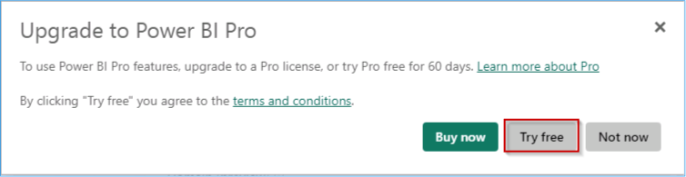

11. *Click on the **Got it** button to continue.*
    -->

<!-- 12. Click on **Workspaces** to verify if the workspace with the given name was created, if not perform the steps above again.

>**NOTE:** If the workspace you created is not visible, perform **step 8** again. -->
<!-- 
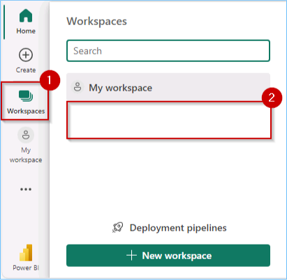 -->

   
<!-- >**Note:** Click on the collapse icon, as shown in the screenshot below, for better visibility.

 -->

### Create/Build a Lakehouse

Now, let's see how each department can easily create a Lakehouse in the Contoso workspace without any provisioning. They simply provide a name, given the proper access rights of course!

1. Click on the **experience** button at the **bottom left** corner of the screen (In this screenshot, **Power BI** is selected as an "Experience") and then select **Data Engineering**.

2. In the new window, under Data Engineering, click **Lakehouse**.

3. Enter the name by clicking on +++**lakehouse**+++.

4. Click the **Create** button.

   

<!-- 5. Click on **Workspaces** in the left navigation pane and select ContosoSales@lab.LabInstance.Id

 -->

5. Click on the **experience** button at the **bottom left** corner of the screen (In this screenshot, **Data Engineering** is selected as an "Experience") and then select **Data Factory**.

6. Click on **Data pipeline**.

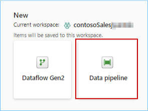

>**Note:** Remove the pre-populated pipeline name from the text box.

7. In the New Pipeline pop-up, type the pipeline name +++Azure SQL DB Pipeline+++ and click on the **Create** button.

8. The following options are available in the data pipeline to build a system for organizing and moving the data.

<!-- > Due to time constraints, copy data activity in Data pipeline is optional. To continue with **optional** steps [click here](#creating-a-data-pipeline) -->

>**Note:** Due to time constraints, we will not be ingesting data using Data pipeline at this time. You can perform this optional step (found in the appendix) later.

13. Similarly, you can get data into the Lakehouses using pipelines from a variety of other sources like Snowflake, Dataverse, etc. Your next task is to ingest website bounce rate data from the acquired company Litware Inc.

---

### Task 1.2: Use the ‘New Shortcut’ option from external data sources

Now this is something exciting and powerful! This section shows how easy it is to create shortcuts without actually moving data. That is the power of OneLake! In this exercise, you will ingest the curated bounce rate data for Litware from ADLS Gen2 as an illustration.

1. Click on the **ContosoSales@lab.LabInstance.Id** workspace.

2. Drag the bar up to view the entire list of items.

3. Click on **Filter** and select **Lakehouse**.

4. Click on the **lakehouse**.

>**Note:** There are 3 options for lakehouse, namely Lakehouse, Semantic model (default) and SQL analytics endpoint. Make sure you select the **Lakehouse** option.

5. Click on the **three dots (ellipses)** on the right side of Files.

6. Click on **New shortcut**.

>**Note:** Make sure you create a shortcut under **files** and not under **tables** in the lakehouse explorer pane.

7. In the pop-up window, under **External sources**, select the **Azure Data Lake Storage Gen2** source.

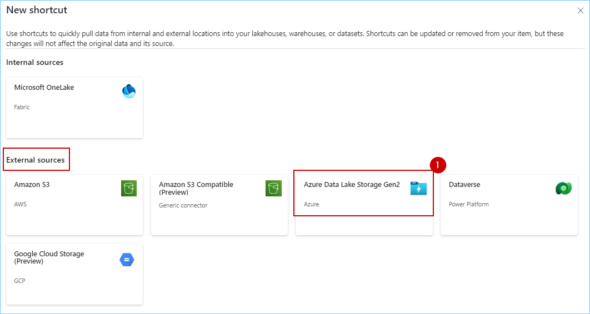

>**Note:** Wait for the screen to load.

8. In the screen below, we need to enter the connection details for the ADLS Gen2 shortcut.

9. In the **URL** field type the endpoint +++https://stfabricadb@lab.LabInstance.Id.dfs.core.windows.net/+++

10. In the **Authentication kind** dropdown, select **Account Key**.

11. Type the **account key** +++@lab.Variable(storageaccountkey)+++

> **Note:** Wait for the Account Key to populate. The cursor will start blinking.

12. Click on **Next**.

13. Select the **data** checkbox and click on the **Next** button.

14. Click on the **Create** button.

15. And there you go! Your shortcut is now ready! Simply click (do not expand) on the newly created shortcut named **data**.

16. Scroll down in the **middle of the screen**, click on the **three dots (ellipses)** on the right side of **website_bounce_rate.csv**.

17. Click on **Load to Tables** and select **New table**.

18. In the pop-up verify the **New table name** and then click on the **Load** button. 

19. Expand **Tables** in lakehouse explorer, click on **website_bounce_rate** delta table and view the website bounce rate data.

20. You now have a table in **OneLake** with all the website bounce rate information for Contoso to leverage. Next, we proceed with data transformation using Dataflow Gen2 to transform the sales data ingested from Litware. 

---

### Task 1.3: Use Leverage Dataflow Gen2 and data pipelines for a "No Code-Low Code" experience to quickly ingest data with Fast Copy and transform it using Copilot

In this exercise, you will experience how easy it is to use Copilot to transform Litware's sales data into the lakehouse. 

1. Click on the **experience** button at the **bottom left** corner of the screen (In this screenshot, **Data Factory** is selected as an "Experience") and then select **Data Factory**.

2. Click on **Dataflow Gen2**.

3. Click on the top part of the **Get data** icon (**not on the dropdown arrow at the bottom of the icon**).

4. In the pop-up window, scroll down to **OneLake data hub** and click on **lakehouse**.

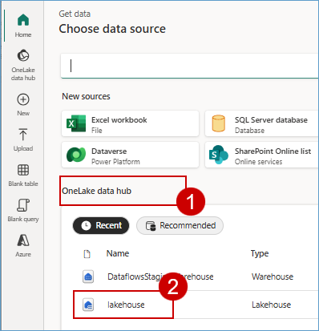

5. If you see a screen similar to the one shown below, click on the **Next** button.

6. Expand **Lakehouse**, expand **Files** and then expand **data**. 

7. Select the **sales_data.csv** checkbox, then **click** on the **Create** button.

8. Collapse the **Queries** pane and take a look at the sales dataset (**note that the first row of this dataset is not a header**).

>> **Let's use Copilot to perform data cleansing.**

9. Click on the **Copilot** button, paste the **prompt** provided below in the text box and click on the **send** icon.

+++In the table sales_data csv, apply first row as headers.+++

>**Note:** If Copilot needs additional context to understand your query, consider rephrasing the prompt to include more details.

10. Scroll to the right hand side and observe the **GrossRevenue** and **NetRevenue** columns (**there are some empty rows with null values**).

>> **Let's use Copilot to remove empty rows.**

11. Similarly, paste the prompt below in Copilot and click on the **send** icon.

+++Remove empty rows from GrossRevenue and NetRevenue columns.+++

12. Scroll to the right hand side and observe the **GrossRevenue** and **NetRevenue** columns (**there are no empty rows with null values**).

>**Note:** Due to time constraints, we will not publish and run the Dataflow from the Pipeline.

>**Note:** If necessary, scroll up to show the close icon.

12. Click on the **close** icon at top right of the **Dataflow** window.

13. Click on **Yes**.

Congrats for completing this data transformation exercise! As you know, Litware was primarily using Azure Databricks with their data stored in ADLS Gen2 before the acquisition. Post merger, as one unified company – Contoso – they decided to leverage Azure Databricks to build and manage reliable data pipelines via Delta Live Tables (DLT). Now, you will see the amazing power of Unity Catalog that Contoso’s data architects used to quickly learn all about Litware's data without having to go through tons of documents. And all by simply leveraging AI and data intelligence.

### Task 1.4: Explorer Task Flows in Microsoft Fabric

===

**Table of Contents**
 
1. [Exercise 1: Data Engineering experience, Data ingestion from a spectrum of analytical data sources into OneLake](#exercise-1-data-engineering-experience-data-ingestion-from-a-spectrum-of-analytical-data-sources-into-onelake)

 	- [Task 1.1: Create a Microsoft Fabric enabled workspace]
	(#task-11-Create a Microsoft Fabric enabled workspace)

 	- [Task 1.2: Use the ‘New Shortcut’ option from external data sources]
	(#task-12-use-the-new-shortcut-option-from-external-data-sources)

 	- [Task 1.3: Use Leverage Dataflow Gen2 and data pipelines for a "No Code-Low Code" experience to quickly ingest data with Fast Copy and transform it using Copilot]
	(#task-13-Use Leverage Dataflow Gen2 and data pipelines for a "No Code-Low Code" experience to quickly ingest data with Fast Copy and transform it using Copilot)
	- [Task 1.4: Explorer Task Flows in Microsoft Fabric]
	(#task-14-Explorer Task Flows in Microsoft Fabric)
 

2. **[Exercise 2: Azure Databricks integration with Fabric: DLT Pipelines, Unity Catalog (Data governance), Mirrored Azure Databricks Catalog](#exercise-2-azure Databricks integration with Fabric: DLT Pipelines, Unity Catalog (Data governance), Mirrored Azure Databricks Catalog)**

	- [Task 2.1: Create Delta Live Table pipeline (For Data Transformation)]	(#task-21-Create Delta Live Table pipeline (For Data Transformation))

	- [Task 2.2: Explore the data in the Azure Databricks environment with Unity Catalog(unified governance solution for data and AI)]	(#task-22-Explore the data in the Azure Databricks environment with Unity Catalog(unified governance solution for data and AI))
	
	- [Task 2.3: Create mirrored Azure Databricks catalog in Fabric and analyze data using T-SQL]	
	(#optional-task-23-Create mirrored Azure Databricks catalog in Fabric and analyze data using T-SQL)

3. [Exercise 3: Power BI Experience in Fabric]
(#exercise-Power BI Experience in Fabric)
	- [Task 3.1: Create a Semantic model and generate insights using Copilot for Power BI in Microsoft Fabric]
	(#task-31-create-a-semantic-model-and-generate-insights-using-copilot-for-power-bi-in-microsoft-fabric)

4. [Exercise 4: Real-time Analytics experience: Explore Streaming data using Copilot for KQL DB](#exercise-4-real-time-analytics-experience-explore-streaming-data-using-copilot-for-kql-db)

	- [Task 4.1: Ingest real-time/historical data into KQL DB using Eventstream]
	(#task-41-ingest-real-timehistorical-data-into-kql-db-using-eventstream)
	
	- [Task 4.2: Analyze/discover patterns, identify anomalies and outliers using Copilot for KQL DB](#task-42-analyzediscover-patterns-identify-anomalies-and-outliers-using-copilot-for-kql-db)
	
	[Optional Exercises](#optional-exercises)
5. [Exercise 5: Explorer Data Science experience in Microsoft Fabric (Optional)](#exercise-5-data-science-experience-explore-machine-learning-and-business-intelligence-scenarios-in-adb-read-only)

	- [Task 5.1: Build ML models and experiments using Copilot in Fabric](#task-51-build-ml-models-and-experiments-using-copilot-in-fabric)
	- [Task 5.2: Leverage AI skills for Q&A](#task-52-leverage-ai-skill-for-q&a)

---

### Exercise 2: DLT Pipelines-Unity Catalog for Data governance, Metastore experience Retrieval Augmented Generation and Machine Learning

### Task 2.1: Explore Delta Live Table pipeline (Data Transformation)

Delta Live Tables (DLT) allow you to build and manage reliable data pipelines that deliver high-quality data in Lakehouse. DLT helps data engineering teams simplify ETL development and management with declarative pipeline development, automatic data testing, and deep visibility for monitoring and recovery.

1. Open a new tab in your browser and sign in to the Azure Databricks Workspace, by clicking on
+++https://@lab.Variable(workspaceurl)+++ and press **ENTER**.

2. Click on the **Sign in with Microsoft Entra ID**.

3. Scroll down in the left navigation pane and click on **Delta Live Table**.

4. Click on the **Create pipeline** button.

5. Enter the name of the pipeline as +++DLT_Pipeline+++ , scroll down to the **Paths** and click on the file icon to browse the notebook.

6. Click on **Shared**.

7. Click on **Analytics with ADB**.

8. Click on the **01 DLT Notebook**.

9. Click on the **Select** button.

10. Click on the **Create** button.

>**Note**: Do not click on the Start button. Due to time constraints, We will not be executing this pipeline.

11. If we were to execute it, we would see a result similar to the one in the following screenshot. Click on the screenshot for a better view.

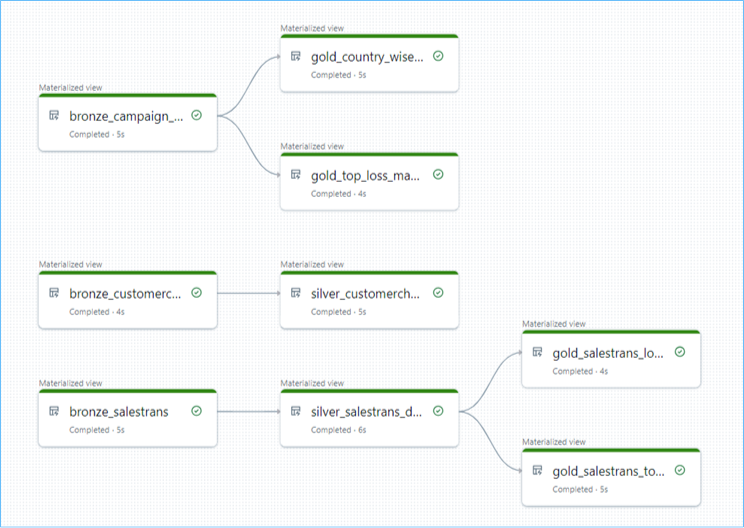

---

### Task 2.2: Explore the data in the Azure Databricks environment with Unity Catalog (unified governance solution for data and AI).

We saw how Contoso utilized DLT pipelines to create a medallion architecture on their data. Now let’s look at how data governance was managed on this curated data across the organization and made easy with Unity Catalog.
 
With the acquisition of Litware Inc., Contoso had a lot of data integration and interoperability challenges. They wanted to make sure that the transition was smooth, and their data engineers and data scientists could easily assimilate the data processed by Databricks. Thankfully, they were able to leverage Gen AI features right within Azure Databricks to understand and derive insights from this data.

>**Note**: Due to time constraints, the following steps
will be completed via an online Click-by-Click exercise. Please follow the green beacons for this exercise.
- This exercise will be performed outside the VM browser.
- Please return back to the VM browser once you see the **End of Task 2.2** screen.
- Once you press the **Agree** button, press the **A** key on your keyboard if you do not see the annotations.

	
1. Click on the [**hyperlink**](https://regale.cloud/Microsoft/viewer/3066/task-22-explore-the-data-in-azure-databricks-environment-with-unity-catalog/index.html#/0/1)

2. Continue with next excercise.

<!--

2. Click on the **Start Demo** button.

3. Click on the **Agree** button on the legal notice page.

4. Follow the green beacons and expand **litware_unity_catalog db**.

5.	Expand the **rag** schema and click on **tables**.

6.	Click on **silver_customer_churn** table.

7.	Click on **Accept** in 'AI Suggested Comment' box and click on **AI Generate**.

	
We can see that AI in Azure Databricks has autogenerated the description for the table and its columns based on upstream and downstream data. Users can choose to accept the descriptions or edit them further. This improves the ease of governance on this new data for Contoso. There’s no need for Contoso’s data engineers to read through tons of documents to learn about Litware's data. Amazing, right? Next, let's see how easy it is to query this data.

	
8.	Select the dropdown on **Create**.

9.	Click on **Query**.

	
10.	Select the **Assistant** tab.

11.	Click on the query area and click on the **send** button.
	

	
By simply using a natural language query and leveraging the AI generated table and field descriptions, Azure Databricks generates an equivalent SQL query. There’s no need to be skilled in SQL queries and it’s so business friendly!
	
12. Click on the **Arrow** to replace the current code.

13.	Click on **Run**.

14.	Check the output.

Users also have the capability to fix errors in queries with the AI assistant. Let's intentionally introduce an error by misspelling a table name and see the AI's response.
	
15.	In the query, click on **churnstatus** to misspell it.

16.	Click on **Run** to see the error.

17.	Click on **Diagnose error** to fix the query issue. See how easily the error is fixed! It is like having a virtual assistant available 24 hours!

18. Click on the **Arrow** to replace the current code.

	
Data discovery is also made simple within Azure Databricks. Users can simply search for table names or the information they are looking for in the global search and all the relevant items are returned, again leveraging the table and field descriptions created by AI and data intelligence.
	
19.	Click on **Search**.

20.	Click on **Open search in a full page**.

21.	Click on the search box to search for **Find information about customers who have churned with paperless billing and short tenure.** and then click on Show all results. Contoso’s next challenge was to get visibility of their Market Sentiment KPI. Remember, the Market Sentiment before the acquisition was at an all-time low. News articles and analyst reviews were being continuously published. All this unstructured data had to be efficiently assimilated so that the Market Sentiment could be tracked. 

-->
===

**Table of Contents**
 
1. [Exercise 1: Data Engineering experience, Data ingestion from a spectrum of analytical data sources into OneLake](#exercise-1-data-engineering-experience-data-ingestion-from-a-spectrum-of-analytical-data-sources-into-onelake)

 	- [Task 1.1: Use the Data Pipelines/Data Flow for a 'No Code, Low Code experience']
	(#task-11-use-the-data-pipelinesdata-flow-for-a-'no-code-low-code-experience')

 	- [Task 1.2: Use the 'New Shortcut' option from external data sources]
	(#task-12-use-the-new-shortcut-option-from-external-data-sources)

 	- [Task 1.3: Transform data using Dataflow Gen2 using a 'No Code, Low Code experience' Copilot]
	(#task-13-transform-data-using-dataflow-gen2-using-a-no-code-low-code-experience-copilot)
 

2. [Exercise 2: DLT Pipelines, Unity Catalog (Data governance), Metastore experience, Retrieval Augmented Generation (RAG) and Machine Learning (ML)](#exercise-2-dlt-pipelines-unity-catalog-for-data-governance-metastore-experience-retrieval-augmented-generation-and-machine-learning)

	- [Task 2.1: Explore Delta Live Table pipeline (Data Transformation)]	(#task-21-explore-delta-live-table-pipeline-data-transformation)

	- [Task 2.2: Explore the data in the Azure Databricks environment with Unity Catalog (unified governance solution for data and AI)]	(#task-22-explore-the-data-in-the-azure-databricks-environment-with-unity-catalog-unified-governance-solution-for-data-and-ai)
	
	- [(Optional) Task 2.3: Deploy LLM Chatbots with the Databricks Data Intelligence Platform]
	(#optional-task-23-deploy-llm-chatbots-with-the-databricks-data-intelligence-platform)

3. **[Exercise 3: Power BI Experience]
(#exercise-3-power-bi-experience)**
	- [Task 3.1: Create a Semantic model and generate insights using Copilot for Power BI in Microsoft Fabric]
	(#task-31-create-a-semantic-model-and-generate-insights-using-copilot-for-power-bi-in-microsoft-fabric)

[Optional Exercises](#optional-exercises)

4. [Exercise 4: Real-time Analytics experience: Explore Streaming data using Copilot for KQL DB](#exercise-4-real-time-analytics-experience-explore-streaming-data-using-copilot-for-kql-db)

	- [Task 4.1: Ingest real-time/historical data into KQL DB using Eventstream]
	(#task-41-ingest-real-timehistorical-data-into-kql-db-using-eventstream)
	
	- [Task 4.2: Analyze/discover patterns, identify anomalies and outliers using Copilot for KQL DB](#task-42-analyzediscover-patterns-identify-anomalies-and-outliers-using-copilot-for-kql-db)
	
5. [Exercise 5: Data Science experience: Explore Machine Learning and Business Intelligence scenarios in ADB](#exercise-5-data-science-experience-explore-machine-learning-and-business-intelligence-scenarios-in-adb-read-only)

	- [Task 5.1: Build ML models, experiments, and log ML models in the built-in model registry using MLflow and batch scoring](#task-51-build-ml-models-experiments-and-log-ml-models-in-the-built-in-model-registry-using-mlflow-and-batch-scoring)

---

### Exercise 3: Power BI Experience
 
### Task 3.1: Create a Semantic model and generate insights using Copilot for Power BI in Microsoft Fabric

With the wide spectrum of data sources and Litware's data in OneLake, it is now time to get some awesome insights and visualizations from this data. Let's dive deep into the experience of the Business Analyst, Wendy, and do just that. Based on all the gathered data, Wendy is expected to create Power BI reports for other data citizens and stakeholders. Let's step into her shoes to experience the power of Copilot for Power BI in conjunction with Direct Lake Mode.

1. Navigate back to the Microsoft Fabric tab on your browser.

1. Click on **Workspaces** and select **ContosoSales@lab.LabInstance.Id**.

2. Click on **Filter** and select **Lakehouse**.

3. Click on the **lakehouse**.

>**Note:** There are 3 options for lakehouse, namely Lakehouse, Semantic model(Default) and SQL endpoint. Make sure you select the **Lakehouse** option.

4. Click on the **New semantic model** button. 

5. In the Name field enter +++website_bounce_rate_model+++.

6. Select workspace as **ContosoSales@lab.LabInstance.Id** and scroll down if you see a scroll bar.

7. Select **website_bounce_rate** table and click on the **Confirm** button. 

>Wait for the semantic model creation.

8. To create a new report using this semantic model, click on **New Report** in the top bar.
 

9. Click on the **Copilot** icon and collapse the other panes for Filters, Visualizations and Data.

>**Note:** Close any pop-up that appears on the screen.

10. Click on the **Get started** button. You will now see how easy it is for the data analyst to create compelling Power BI reports and get deep insights with literally no hands-on coding!

	
10. Click on the **Prompt Guide** button.

  

11. Select the option **What's in my data?**

 > **Note:** If you don't see the 'What's in my data?' option, click in the Copilot chat box field, enter the prompt below, and click the send button: 
+++What's in my data?+++

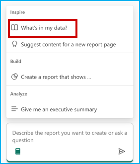

The first option, 'What’s in my data?' provides an overview of the contents of the dataset, identifies and describes what’s in it and what the attributes are about. So, there’s no need to wait for someone to explain the dataset. This improves the efficiency and volume of report creation.

12. Click in the Copilot chat box field and enter the prompt below.

+++Create a report Bounce Rate analysis, to show the correlation between customer sentiment, particularly among millennials and Gen Z, unsuccessful product searches across different devices, and the website's bounce rate by customer generations.+++  

>**Note:** Wait for the prompt to populate.

13. Click on the **Send** button and wait for the results to load. 

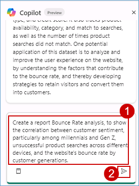
	
>**Note:** If you see the error message saying, 'Something went wrong.', try refreshing the page and restart the task. Being in a shared environment, the service may be busy at times.
- If Copilot needs additional context to understand your query, consider rephrasing the prompt to include more details

>**Note:** The responses from Copilot may not match the ones in the screenshot but will provide a similar response.

Based on this report, we notice that the website bounce rate for Contoso is especially high amongst the Millennial customer segment. Let’s ask Copilot if it has any recommendations for improving this bounce rate based on the results and data in the report.

We’ll ask Copilot for suggestions based on the results and data in the report. 

14. Enter the following prompt in Copilot, +++Based on the data in the page, what can be done to improve the bounce rate of millennials?+++ and press the **Send** button.
	

	
15. Look at the suggestions Copilot provided. Copilot creates the desired Power BI report and even goes a step further to give powerful insights. Wendy realizes that for the website bounce rate to improve, Contoso needs to transform their mobile website experience for millennials. This helps them reduce their millennial related customer churn too! Now, what if Contoso’s leadership team needed a quick summary of this entire report? **Smart Narrative** to the rescue! 
	

	
16. Expand the **Visualizations** pane and select the **Narratives** visual. 

17. Click on **Copilot (preview)** within the visual.

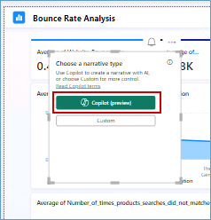
	
18. Select **Give an executive summary**. 

19. Click on **Update** and observe the generated summary. See how easy it was to get an executive summary with absolutely no IT resource dependency!
 
> **Note:** If you don't see 'Give an executive summary' option, click in the Copilot narrative chat box field, enter the prompt below, and click on **Update** :
+++Summarize the data, provide an executive summary, indicating important takeaways.+++

20. Expand the narrative from the corner to get a better readable view of the result.

21. Click on the **close** button in the pop-up window.

	
The summary could also be generated in another language if specified. Additionally, the summary updates if you filter the report on any visual.

===

## [Optional Exercises]

**Table of Contents**
 
1. [Exercise 1: Data Engineering experience, Data ingestion from a spectrum of analytical data sources into OneLake](#exercise-1-data-engineering-experience-data-ingestion-from-a-spectrum-of-analytical-data-sources-into-onelake)

 	- [Task 1.1: Use the Data Pipelines/Data Flow for a 'No Code, Low Code experience']
	(#task-11-use-the-data-pipelinesdata-flow-for-a-'no-code-low-code-experience')

 	- [Task 1.2: Use the 'New Shortcut' option from external data sources]
	(#task-12-use-the-new-shortcut-option-from-external-data-sources)

 	- [Task 1.3: Transform data using Dataflow Gen2 using a 'No Code, Low Code experience' Copilot]
	(#task-13-transform-data-using-dataflow-gen2-using-a-no-code-low-code-experience-copilot)

2. [Exercise 2: DLT Pipelines, Unity Catalog (Data governance), Metastore experience, Retrieval Augmented Generation (RAG) and Machine Learning (ML)](#exercise-2-dlt-pipelines-unity-catalog-for-data-governance-metastore-experience-retrieval-augmented-generation-and-machine-learning)

	- [Task 2.1: Explore Delta Live Table pipeline (Data Transformation)]	(#task-21-explore-delta-live-table-pipeline-data-transformation)

	- [Task 2.2: Explore the data in the Azure Databricks environment with Unity Catalog (unified governance solution for data and AI)]	(#task-22-explore-the-data-in-the-azure-databricks-environment-with-unity-catalog-unified-governance-solution-for-data-and-ai)
	
	- [(Optional) Task 2.3: Deploy LLM Chatbots with the Databricks Data Intelligence Platform]
	(#optional-task-23-deploy-llm-chatbots-with-the-databricks-data-intelligence-platform)

3. [Exercise 3: Power BI Experience]
(#exercise-3-power-bi-experience)
	- [Task 3.1: Create a Semantic model and generate insights using Copilot for Power BI in Microsoft Fabric]
	(#task-31-create-a-semantic-model-and-generate-insights-using-copilot-for-power-bi-in-microsoft-fabric)

**[Optional Exercises](#optional-exercises)**

4. **[Exercise 4: Real-time Analytics experience: Explore Streaming data using Copilot for KQL DB](#exercise-4-real-time-analytics-experience-explore-streaming-data-using-copilot-for-kql-db)**

	- [Task 4.1: Ingest real-time/historical data into KQL DB using Eventstream]
	(#task-41-ingest-real-timehistorical-data-into-kql-db-using-eventstream)
	
	- [Task 4.2: Analyze/discover patterns, identify anomalies and outliers using Copilot for KQL DB](#task-42-analyzediscover-patterns-identify-anomalies-and-outliers-using-copilot-for-kql-db)
	
5. [Exercise 5: Data Science experience: Explore Machine Learning and Business Intelligence scenarios in ADB](#exercise-5-data-science-experience-explore-machine-learning-and-business-intelligence-scenarios-in-adb-read-only)

	- [Task 5.1: Build ML models, experiments, and log ML models in the built-in model registry using MLflow and batch scoring](#task-51-build-ml-models-experiments-and-log-ml-models-in-the-built-in-model-registry-using-mlflow-and-batch-scoring)

---

### Exercise 4: Real-time Analytics experience: Explore Streaming data using Copilot for KQL DB

Imagine it is 6 am on the day of Contoso's big Thanksgiving sale. Customers are flocking to their stores in large numbers. We are about to witness the very culmination of Contoso's phenomenal transformation with Microsoft Fabric and Azure Databricks. Specifically, we will see how near real-time data is used to make decisions for the next moment in Contoso's stores to ensure optimal temperatures are maintained for their customers while they shop at the big sale!

### Task 4.1: Ingest real-time/historical data into KQL DB using Eventstream

1. Click on the **experience** button at the **bottom left** corner of the screen (In this screenshot, **Data Factory** is selected as an "Experience") and then select **Real-Time Intelligence**.

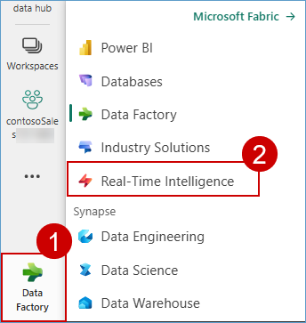

>**Note:** If you see a pop-up like the one below, click on the **Don't save** button.

 

2. On the Real-Time Intelligence experience screen, click on **Eventhouse**.

3. Enter the name +++Contoso-Eventhouse+++.

4. Click on the **Create** button and wait for the database to be created.

>**Note:** If you see a pop-up like the one in the screenshot below, ignore it and proceed with the next step.

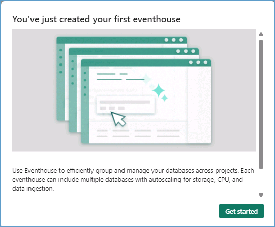

5. Click on the **experience** button at the **bottom left** corner of the screen (In this screenshot, **Real-Time Intelligence** is selected as an "Experience") and then select **Real-Time Intelligence**.

6. Select **Eventstream**.

7. Enter the name as +++RealtimeDataTo-KQL-DB+++ and tick a checkbox 'Enhanced Capabilities(preview)' then click on **Create** button.

8. Click on the **Add external source** button.

9. Click on the **Azure Event Hub** button.

10. Under the Connection field, click on **New connection**.

11. Enter the value for the **Event Hub namespace** as +++evh-thermostat-@lab.LabInstance.Id+++ and enter the **Event Hub** value as +++thermostat+++.

12. Scroll down and select **Shared Access Key** for Authentication kind, enter the Shared Access Key Name as +++thermostat+++ and then Enter the value +++@lab.Variable(EventHubKey)+++ in the **Shared Access Key** and then click on the **Connect** button.

>**Note:** Close any pop-up that appears on the screen.

>**Note:** Close any pop-up which appears on screen.

13. Select Data format as **JSON** and click on **Next**.

>**Note:** Wait for the connection to be established.

14. Click on the **Add** button.

15. In the Eventstream canvas, click on the **Add destination** dropdown and select **KQL Database**.

16. Select the **Event processing before ingestion** radio button, enter +++RealTimeData+++ as the Destination name.

17. In the **Workspace** field select **ContosoSales@lab.LabInstance.Id**. 

18. In the **KQL Database** dropdown select **Contoso-Eventhouse**

19. Click on the **Create new** button.

20. Enter the table name as +++thermostat+++ and then click on the **Done** button.

21. Enter the Input data format as **Json**.

>**Note:** Zoom-out on your screen if the Input data format field is not visible.

22. Drag Arrow from 'RealtimeDataTo-KQL' and connect it to 'RealTimeData'.

23. Click on the **Publish** button.

>**Note:** Wait for the data ingestion from EventHub to KQL DB.

24. Once you see that the streaming has started, click on **Refresh** and wait for the data to preview.

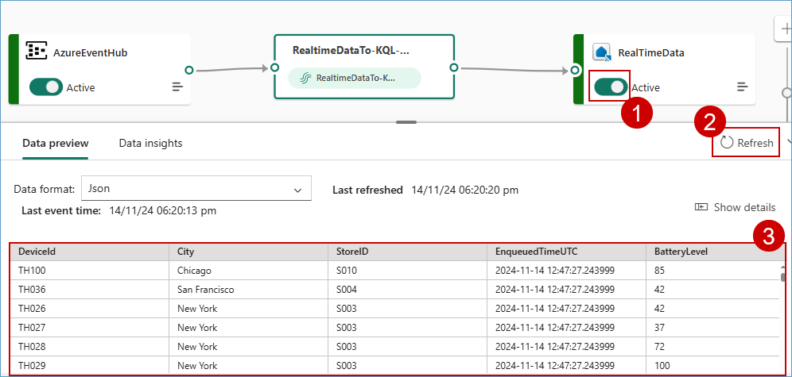

Real-time data from the event hub has been ingested successfully into the KQL Database. Next, as customers walk in aisles and the temperatures fluctuate, let us see how KQL queries proactively identify anomalies and help maintain an optimal shopping experience!

---

### Task 4.2: Analyze/discover patterns, identify anomalies and outliers using Copilot for KQL DB

Kusto Query Language is a powerful tool. In this scenario KQL is used to explore Contoso’s data, discover patterns, identify anomalies and outliers, create statistical modeling, and more.

We use KQL to query the thermostat data that’s streaming in near real-time from the devices installed in Contoso’s stores.

1. Click on **Workspaces** and select **ContosoSales@lab.LabInstance.Id** workspace from the left navigation pane.

2. Click on the **experience** button at the **bottom left** corner of the screen (In this screenshot, **Real-Time Intelligence** is selected as an "Experience") and then select **Real-Time Intelligence**.

3. Select **KQL Queryset**.

4. In the KQL Queryset name field, +++Query Thermostat Data in Near Real-time using KQL Script+++ and click on the **Create** button.

5. **Wait** for the query set creation and a new screen will display. In this screen, click on **Contoso-Eventhouse**, verify the workspace name and then click on the **Connect** button.

6. Place your cursor inside the **query** field, select all using **Ctrl + A** and **delete** the pre-written query.

7. Click on the **Copilot** button.

8. **Paste** the query provided below in the Copilot query section.

+++Create a query to find average temperature every 1 min+++

9. Click on the **send** icon.

>**Note:** The responses from Copilot may not match the ones in the screenshot but will provide a similar response. 

10. Click on the **Insert** button.

11.	Place you cursor in the **script field**, click on the **Run** button and you get the desired result.

So, imagine if one of the aisles had a sudden rise in temperature. Customers start leaving that aisle and the wait times in the checkout lines start to increase. But thanks to the KQL Queries, those anomalies would be tracked, and immedia/labMediate notifications would be generated to bring the aisle temperature back to optimal levels! Now, after all these amazing data transformations in OneLake in a healthy ecosystem with Azure Databricks, can we actually predict customer churn for the future? Absolutely! In fact, in the next exercise, let’s see the power of Microsoft Fabric and Azure Databricks to do just that!

===
**Table of Contents**
 
1. [Exercise 1: Data Engineering experience, Data ingestion from a spectrum of analytical data sources into OneLake](#exercise-1-data-engineering-experience-data-ingestion-from-a-spectrum-of-analytical-data-sources-into-onelake)

 	- [Task 1.1: Use the Data Pipelines/Data Flow for a 'No Code, Low Code experience']
	(#task-11-use-the-data-pipelinesdata-flow-for-a-'no-code-low-code-experience')

 	- [Task 1.2: Use the 'New Shortcut' option from external data sources]
	(#task-12-use-the-new-shortcut-option-from-external-data-sources)

 	- [Task 1.3: Transform data using Dataflow Gen2 using a 'No Code, Low Code experience' Copilot]
	(#task-13-transform-data-using-dataflow-gen2-using-a-no-code-low-code-experience-copilot)
 

2. [Exercise 2: DLT Pipelines, Unity Catalog (Data governance), Metastore experience, Retrieval Augmented Generation (RAG) and Machine Learning (ML)](#exercise-2-dlt-pipelines-unity-catalog-for-data-governance-metastore-experience-retrieval-augmented-generation-and-machine-learning)

	- [Task 2.1: Explore Delta Live Table pipeline (Data Transformation)]	(#task-21-explore-delta-live-table-pipeline-data-transformation)

	- [Task 2.2: Explore the data in the Azure Databricks environment with Unity Catalog (unified governance solution for data and AI)]	(#task-22-explore-the-data-in-the-azure-databricks-environment-with-unity-catalog-unified-governance-solution-for-data-and-ai)
	
	- [(Optional) Task 2.3: Deploy LLM Chatbots with the Databricks Data Intelligence Platform]
	(#Optional-task-23-deploy-llm-chatbots-with-the-databricks-data-intelligence-platform)

3. [Exercise 3: Power BI Experience]
(#exercise-3-power-bi-experience)
	- [Task 3.1: Create a Semantic model and generate insights using Copilot for Power BI in Microsoft Fabric]
	(#task-31-create-a-semantic-model-and-generate-insights-using-copilot-for-power-bi-in-microsoft-fabric)

**[Optional Exercises](#optional-exercises)**

4. [Exercise 4: Real-time Analytics experience: Explore Streaming data using Copilot for KQL DB](#exercise-4-real-time-analytics-experience-explore-streaming-data-using-copilot-for-kql-db)

	- [Task 4.1: Ingest real-time/historical data into KQL DB using Eventstream]
	(#task-41-ingest-real-timehistorical-data-into-kql-db-using-eventstream)
	
	- [Task 4.2: Analyze/discover patterns, identify anomalies and outliers using Copilot for KQL DB](#task-42-analyzediscover-patterns-identify-anomalies-and-outliers-using-copilot-for-kql-db)
	
5. **[Exercise 5: Data Science experience: Explore Machine Learning and Business Intelligence scenarios in ADB](#exercise-5-data-science-experience-explore-machine-learning-and-business-intelligence-scenarios-in-adb-read-only)**

	- [Task 5.1: Build ML models, experiments, and log ML models in the built-in model registry using MLflow and batch scoring](#task-51-build-ml-models-experiments-and-log-ml-models-in-the-built-in-model-registry-using-mlflow-and-batch-scoring)

---

### Exercise 5: Data Science experience, explore Machine Learning and Business Intelligence scenarios in ADB (read only)
 
We saw how Contoso combined historical gold layer data from ADLS Gen2 with all the OneLake data via shortcuts. Additionally, we saw how all that data could be easily accessed in Azure Databricks (thanks to the standard delta parquet format). Delta live tables were created in Azure Databricks for further curation of data. Contoso can now leverage the power of machine learning models in Azure Databricks on that data to gain meaningful insights and predict customer churn. Let's explore the Data Science Experience in Azure Databricks as Data Scientists!

### Task 5.1: Build ML models, experiments, and log ML models in the built-in model registry using MLflow and batch scoring

The architecture diagram shown here illustrates the end-to-end MLOps pipeline using the Azure Databricks managed MLflow.

After multiple iterations with various hyperparameters, the best performing model is registered in the Databricks MLflow model registry. Then it is set up as the model serving in the Azure Databricks Workspace for low latency requests.
	

1. Navigate back to the **Databricks workspace** we started for the previous exercise.

2. In the left navigation pane, select **Workspace** and click **Workspace** again. Select **Shared**, click on **Analytics with ADB** and finally click on the **02 ML Solutions in a Box.ipynb** notebook.

Now that we've ingested and processed our customer data, we want to understand what makes one customer more likely to churn than another. Let’s see if we can produce a machine learning model that can accurately predict if a particular customer will churn.

Ultimately, we would like to understand our customers' sentiment so we can create targeted campaigns to improve our sales.

3. Navigate to **cmd 9**.

>**Note:** Command numbers are written at the top of each cell.

With the data prepared, we can begin exploring the patterns it contains. 

Let's start by examining the customer churn outcome based on factors like a customer's tenure in months and their total amount spent at Contoso. As a result, we can see a high churn rate is seen if the customer's tenure is low, and they have a lower spend amount.

4. Navigate to **cmd 19**.

5. Navigate to **cmd 20**. 

By registering this model in Model Registry, we can easily reference the model from anywhere within Databricks.    

6. Review the **cmd 28** cell.

Let’s look at the comparison of multiple runs in the UI.

You can visualize the different runs using a parallel coordinates plot, which shows the impact of different parameter values on a metric.

The best ML model for Customer Churn is selected and registered with Databricks model registry.

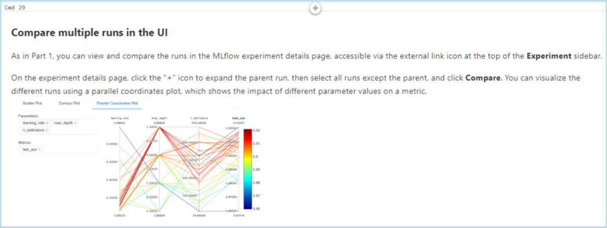

7. Navigate to **cmd 37**.

For low-latency use cases, you can use MLflow to deploy the model for online serving. The serving system loads the Production model version from the Model Registry. 

8. Navigate to **cmd 39**.

It is then used to predict the probability of Customer Churn using the deployed model and this model endpoint is ready for production.

9. Navigate to **cmd 40**. 

Once we have the predicted data, it is stored back in delta tables in the gold layer back in OneLake.

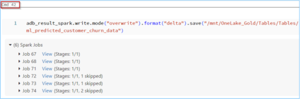

---
### Task 1.1: Use the Data Pipelines/Data Flow for a ‘No Code, Low Code experience’ (Optional)

### Creating a Data Pipeline 

1. Navigate back to Microsoft Fabric tab on your browser. 

2. Click on **Workspaces** in the left navigation pane and select +++ContosoSales@lab.LabInstance.Id+++

3. Click on **Filter** and select **Data pipeline**.

4. Click on **Azure SQL DB Pipeline**.

6. In the Data pipeline window, click on **Copy data assistant**.

7. In the pop-up, click on **+New** tab and scroll down through the resources, click on **Azure SQL Database**.

>**Note** You may not see the **Azure SQL Database** in the same location as shown in the screenshot.

8. Select the **Create new connection** radio button.

9. In the **Server** field, type SQL Server Endpoint +++@lab.Variable(sqlEndpoint)+++ and enter +++SalesDb+++ in the **Database** field.

10. Scroll down and select **Basic** for Authentication kind, enter +++labsqladmin+++ as the Username, +++Smoothie@2024+++ as the Password and click on the **Next** button.

>**Note:** Close any pop-up that you see throughout the lab.
   

>**Note:** Wait for the connection to be created.

11. Click on the **checkbox** for **Select all** and then click on the **Next** button.

12. Scroll down and click on **Lakehouse**, then click on the **Next** button.

13. Click on the **Existing Lakehouse** radio button, click on the **dropdown**, select **lakehouse** and then click on the **Next** button.

14. Select the **Load to new table** radio button, click on the **checkbox** beside **Source** and then click on **Next**.

15. Click on **Save + Run**.

16. Click on the **OK** button in the Pipeline run window.

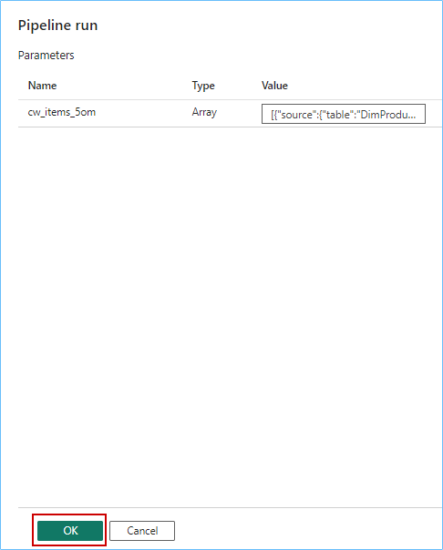

>**Note:** Wait for the pipeline to execute.

17. Click on the bell icon at the top right of the screen to verify the **Running status** of the pipeline.

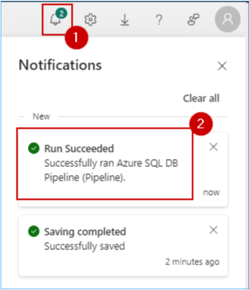

18. Congratulations! You have successfully transferred the Sales data from Azure SQL Database to Lakehouse for Contoso.

---
### (Optional) Task 2.3: Deploy LLM Chatbots with the Databricks Data Intelligence Platform

Contoso also wanted to improve how efficiently they analyzed hundreds of documents and news articles about their big merger and their company policies. Why? To track and improve their Market Sentiment KPI. Azure Databricks provides just the solution with its Delta Lake architecture supporting unstructured data, like PDF documents, with Lang chain models leveraging the Databricks Foundation Model for creating custom chatbots. Let's see how this was done.

>**Note**: This section is optional. Due to time constraints, the following steps will be completed via an online Click-by-Click for setting up the Unity Catalog. Please follow the green beacons and the instructions on the screen for this exercise.
- This exercise will be performed outside the VM browser.
- Please return back to the VM browser once you see the **End of Task 2.3** screen.
- Once you press the **Agree** button, press the **A** key on your keyboard if you do not see the annotations.

	
1. Click on the [**hyperlink**](https://regale.cloud/Microsoft/viewer/3067/task-23-deploy-llm-chatbots-with-the-data-intelligence-platform/index.html#/0/1)

<!--
1. Open the following link in a new tab (Microsoft Edge browser) by clicking on
+++https://regale.cloud/Microsoft/viewer/3067/task-23-deploy-llm-chatbots-with-the-data-intelligence-platform/index.html#/0/0+++

2. Click on the **Start Demo** button.

-->
---

Congratulations! You as Data Engineers have helped Contoso gain actionable insights from its disparate data sources, thereby contributing to future growth, customer satisfaction, and a competitive advantage.

In this lab we experienced the creation of a simple integrated, open and governed Data Lakehouse foundation using Modern Analytics with Microsoft Fabric and Azure Databricks.

In this lab we covered the following:

First, we explored the Data Engineering experience and learned how to create a Microsoft Fabric enabled workspace, build a Lakehouse, and ingest data into OneLake along with other data engineering operations with dataflow copilot.

Second, we explored an analytics pipeline using open Delta format and Azure Databricks Delta Live Tables to build a simple Lakehouse and integrate with OneLake with shortcuts.

Third, we explored data governance and generative AI features in Azure Databricks with Unity Catalog. We also explored ML and BI scenarios on the Lakehouse. Here we reviewed MLOps pipeline using the Azure Databricks managed MLflow with Azure ML.

Fourth, we saw the Power BI experience in Fabric with copilot and direct lake mode.

Fifth, we explored Streaming data using KQL DB for a Real-time Analytics experience. Here, we created a KQL Database, ingested real-time and historical data into KQL DB, analyzed patterns to uncover anomalies and outliers with the help of copilot.

Finally, we leveraged Power BI to derive actionable insights from data in the Lakehouse using Direct Lake mode.
