# Step-by-Step Instructions to Deploy an ARM Template Using PowerShell

## Prerequisite:
### Github Token extraction

1. Log into Github and click on the **Profile** Icon.


2. Scroll down the page and click on **Developer settings**.


3. Click on **Personal access tokens** dropdown and select **Tokens (Classic)**.

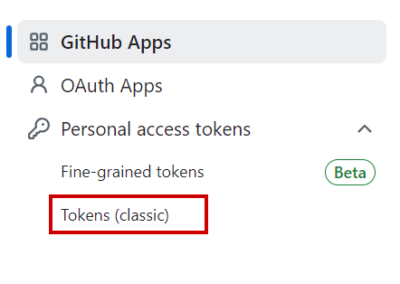

4. In the **Confirm Access** window, provide the password and click on the **Confirm** button.

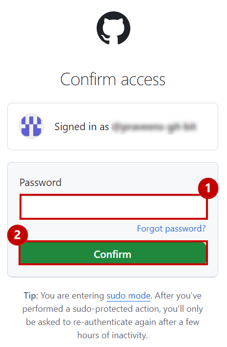

5. Add a note in the **Note** textbox, select the expiration days from the **Expiration** dropdown, and select **repo** checkbox.

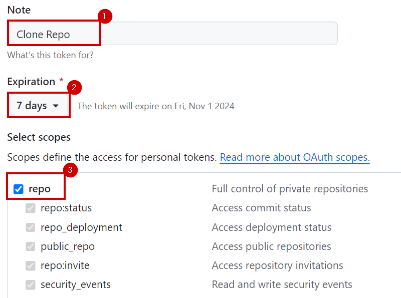

6. Click on the **Generate token** button.


7. Click on copy token from "clipboard" and save it for future reference.


## Deploying ARM Template using Cloud Shell

1. Log into Microsoft Azure portal and click on **Cloud Shell** icon from the menu bar.


2. Select **Powershell**.

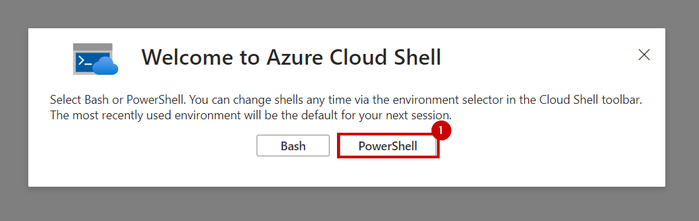

3. Click on **No storage account required** button, then select the required subscription from the **Subscription** dropdown and click on **Apply**.

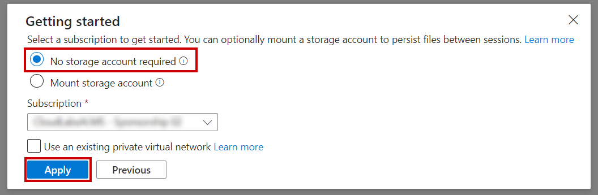

4. In the Cloudshell, enter the below command and press "enter".

```
git clone -b main --depth 1 --single-branch https://github.com/dreamdemos-ms/MS-Ignite.git ignite24
```

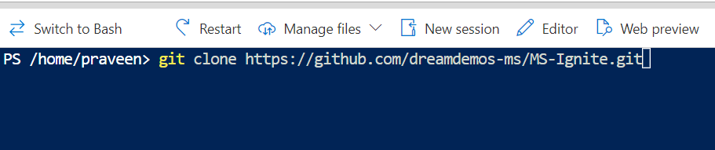

5. Enter your Github **username** and press the **Enter** key.

6. Paste the **token** generated in the Github Token extraction steps and press the **Enter** key.

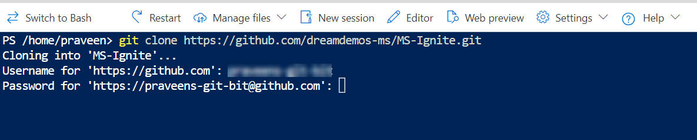

**Note**: Wait till the clone completes as seen in the following screenshot.


7. Paste the following command in Powershell.

```
cd ignite24/02_Lab
```

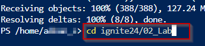

8. Check for the setup file using "ls" command and run the script with following command.

```
./labSetup.ps1
```

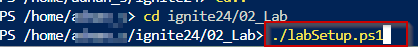

9. Browse the **URL** in another tab of your browser and copy the **code**.

    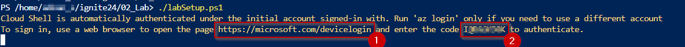

10. Paste the **code** and click on the **Next** button.

    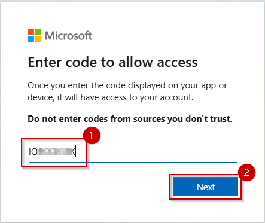

11. Select the **Azure account** to sign in.

     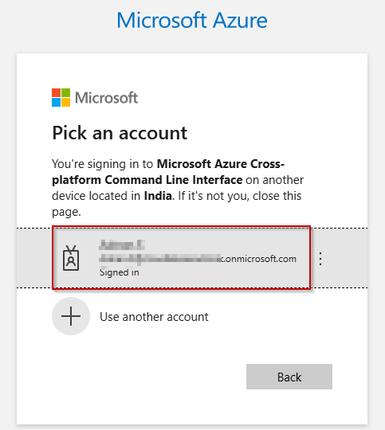

12. Click on the **Continue** button.

    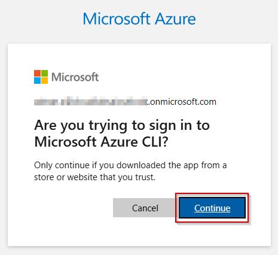

13. When you see the below **screenshot**, close the tab of your browser and go back to the **Cloudshell tab**.

    

14. Select the desired subscription and then press the Enter key.

    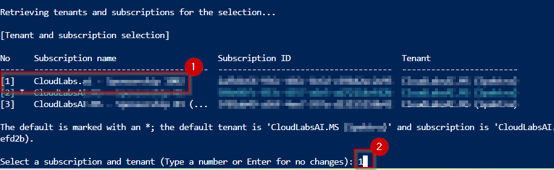

15. Browse the **URL** in another tab of your browser and copy the **code**.

    

16. Paste the **code** and click on the **Next** button.

    

17. Select the **Azure account** to sign in.

     

18. Click on the **Continue** button.

    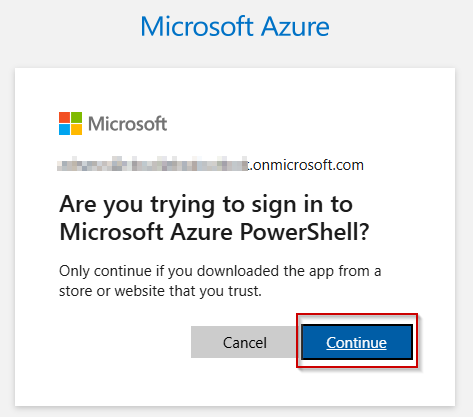

19. When you see the below **screenshot**, close the tab of your browser and go back to the **Cloudshell tab**.

    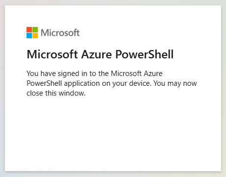

20. Select the region as per your preference.

    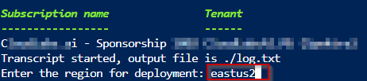

>**Note:** It takes approximately 20 minutes for the deployment

21. Once the deployment is successful, verify if the following resources are deployed.

| S.No | Resource Name |  Resources |
|------|----------|----------|
| 1    | evh-thermostat-... | EventHub Namespace  |
| 2    | kv-ignite-... | Azure Key Vault  |
| 3    | stignite...  | Storage Account   |
| 4    | mssql...    | SQL Server     |
| 5    | SalesDb | SQL Database    |
| 6    | app-realtime-simulator-...  | WebApp - Thermostat |
| 7    | asp-realtime-simulator-... | App Service Plan  |
| 8    | adb-ignite-... | Azure Databricks Workspace | 

22. Goto the resource group in Azure Portal **rg-ignite24-...** and click on the **app-realtime-simulator-..**

    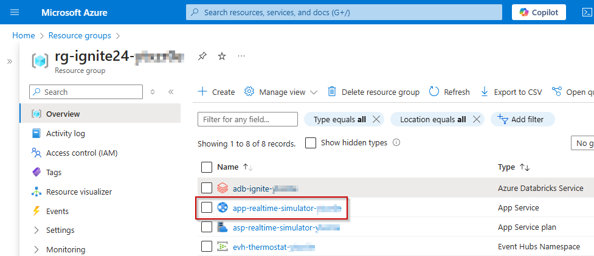

23. Click on the browse button.

    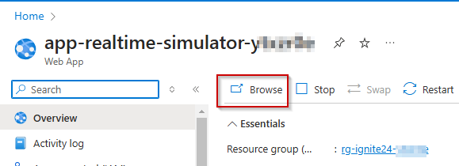

24. Wait for the simulator app to browse until you see a screen as shown in the below screenshot.

    

