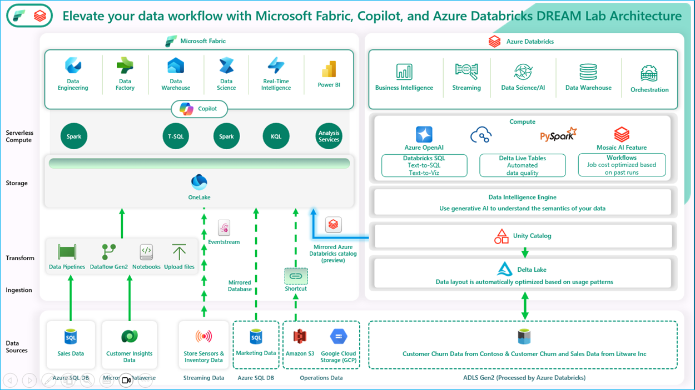

# Lab423: Elevate your data workflow with Microsoft Fabric, Copilot and Azure Databricks DREAM Lab
**The estimated time to complete this lab is 50-60 minutes.**

**DISCLAIMER**

This presentation, demonstration, and demonstration model are for informational purposes only and (1) are not subject to SOC 1 and SOC 2 compliance audits, and (2) are not designed, intended or made available as a medical device(s) or as a substitute for professional medical advice, diagnosis, treatment or judgment. Microsoft makes no warranties, express or implied, in this presentation, demonstration, and demonstration model. Nothing in this presentation, demonstration, or demonstration model modifies any of the terms and conditions of Microsoft’s written and signed agreements. This is not an offer and applicable terms and the information provided are subject to revision and may be changed at any time by Microsoft.

This presentation, demonstration, and demonstration model do not give you or your organization any license to any patents, trademarks, copyrights, or other intellectual property covering the subject matter in this presentation, demonstration, and demonstration model.

The information contained in this presentation, demonstration and demonstration model represents the current view of Microsoft on the issues discussed as of the date of presentation and/or demonstration, for the duration of your access to the demonstration model. Because Microsoft must respond to changing market conditions, it should not be interpreted to be a commitment on the part of Microsoft, and Microsoft cannot guarantee the accuracy of any information presented after the date of presentation and/or demonstration and for the duration of your access to the demonstration model.

No Microsoft technology, nor any of its component technologies, including the demonstration model, is intended or made available as a substitute for the professional advice, opinion, or judgment of (1) a certified financial services professional, or (2) a certified medical professional. Partners or customers are responsible for ensuring the regulatory compliance of any solution they build using Microsoft technologies.

**Copyright**

© 2024 Microsoft Corporation. All rights reserved. 

By using this demo/lab, you agree to the following terms:

The technology/functionality described in this demo/lab is provided by Microsoft Corporation for purposes of obtaining your feedback and to provide you with a learning experience. You may only use the demo/lab to evaluate such technology features and functionality and provide feedback to Microsoft. You may not use it for any other purpose. You may not modify, copy, distribute, transmit, display, perform, reproduce, publish, license, create derivative works from, transfer, or sell this demo/lab or any portion thereof.

COPYING OR REPRODUCTION OF THE DEMO/LAB (OR ANY PORTION OF IT) TO ANY OTHER SERVER OR LOCATION FOR FURTHER REPRODUCTION OR REDISTRIBUTION IS EXPRESSLY PROHIBITED.

THIS DEMO/LAB PROVIDES CERTAIN SOFTWARE TECHNOLOGY/PRODUCT FEATURES AND FUNCTIONALITY, INCLUDING POTENTIAL NEW FEATURES AND CONCEPTS, IN A SIMULATED ENVIRONMENT WITHOUT COMPLEX SET-UP OR INSTALLATION FOR THE PURPOSE DESCRIBED ABOVE. THE TECHNOLOGY/CONCEPTS REPRESENTED IN THIS DEMO/LAB MAY NOT REPRESENT FULL FEATURE FUNCTIONALITY AND MAY NOT WORK THE WAY A FINAL VERSION MAY WORK. WE ALSO MAY NOT RELEASE A FINAL VERSION OF SUCH FEATURES OR CONCEPTS. YOUR EXPERIENCE WITH USING SUCH FEATURES AND FUNCITONALITY IN A PHYSICAL ENVIRONMENT MAY ALSO BE DIFFERENT.

## Table of Contents
 
## Exercise 1: Data Engineering/Data Factory experience - Data ingestion from a spectrum of analytical data sources into OneLake
 
 - Task 1.1: Create a Microsoft Fabric enabled workspace
 - Task 1.2: Use the ‘New Shortcut’ option from external data sources
 - Task 1.3: Create Delta tables using Spark Notebook
 - Task 1.4: Leverage Dataflow Gen2 and Data pipelines for a "No Code-Low Code" experience to quickly ingest data with Fast Copy and transform it using Copilot
 - Task 1.5: Explore Task Flows in Microsoft Fabric

## Exercise 2: Azure Databricks integration with Fabric: DLT Pipelines, Unity Catalog (Data governance), Mirrored Azure Databricks Catalog 

 - Task 2.1: Create Delta Live Table pipeline (For Data Transformation) 
 - Task 2.2: Explore the data in the Azure Databricks environment with Unity Catalog(unified governance solution for data and AI)
 - Task 2.3: Create mirrored Azure Databricks catalog in Fabric and analyze data using T-SQL

 
## Exercise 3: Power BI Experience in Fabric
 
- Task 3.1: Create a Semantic model and generate insights using Copilot for Power BI

## Exercise 4: Real-time Intelligence experience - Explore Streaming data using Copilot for KQL DB
 
- Task 4.1: Ingest real-time/historical data into Eventhouse using Eventstream
- Task 4.2: Analyze/discover patterns, identify anomalies and outliers using Copilot

## Exercise 5: Explorer Data Science experience in Microsoft Fabric (Optional)
 
- Task 5.1: Build ML models and experiments using Copilot in Fabric
- Task 5.2: Leverage AI skills for Q&A 

## Exercise 6:  Datawarehouse Experience (Optional)
- Task 6.1: Create Azure SQL DB Mirroring in Fabric
- Task 6.2: Analyze the mirrored Azure SQL Database data using T-SQL

## Overview

This lab demonstrates how to improve your data workflow using Microsoft Fabric, Copilot, and Azure Databricks. It offers a cost-effective, high-performance, cloud-based solution for analytics. This setup brings together all the customer’s data to help create value faster.

The visual shows an example with Contoso, a fictional retail company with thousands of stores worldwide and an online store. Contoso is acquiring Litware Inc., which has organized marketing and sales data processed using Azure Databricks and stored in the “gold layer” in ADLS Gen2. Contoso also stores its customer churn data in the gold layer in ADLS Gen2. Later, using Dataflow Gen2 and Fabric’s data pipelines, the team employs a “No Code-Low Code” approach to quickly ingest data through Fast Copy and transform it using Copilot. Additionally, by streamlining workflows, Task Flows ensure consistent data ingestion and processing, making data readily available for downstream tasks.

In the following exercises, you'll see how the Contoso team used Microsoft Fabric to pull in data from various sources, merge Litware's data with their own data from ADLS Gen2 and gain valuable insights. You’ll also learn how they used a shortcut to easily access Litware’s data in ADLS Gen2 and how Contoso used Unity Catalog to quickly understand the acquired company’s data. Additionally, Rupesh then leads the team through the Task Flows in Microsoft Fabric, a tool that optimizes their data engineering process making data readily available for downstream tasks. Lastly, you'll explore how they built LLM chatbots using the Databricks Data Intelligence Platform to achieve a new level of market sentiment insights for Contoso. The team explores Eventhouse, using Eventstream to ingest both real-time and historical data into their database, allowing Contoso to monitor current customer interactions alongside historical trends. By analyzing this streaming data with Copilot, they identify important patterns and detect anomalies in real time. These insights empower Contoso to respond quickly to customer needs, boosting satisfaction and engagement.

The lab scenario begins on January 30th. The new CEO, April, has noticed some negative trends in the company’s key metrics, including:

·         High number of customers leaving

·         Falling sales revenue

·         High bounce rate on the website

·         High operating costs

·         Poor customer experience

·         And most importantly, low market sentiment

To address the high customer churn, April and the Contoso team decided to acquire Litware Inc., which carries products popular with millennials. April asks Rupesh, the Chief Data Officer, how they could create a data-driven organization and reverse these adverse KPI trends. Rupesh talks to his technical team, including Eva, the data engineer; Miguel, the data scientist; and Wendy, the business analyst. He tasks them with designing and implementing a solution pattern to realize this vision of a data-driven organization. The team recognizes that the existence of data silos within Contoso's various departments presents a significant integration challenge, which is worsened by the need to combine subsidiary data with data from Litware Inc. To overcome these challenges, they plan to utilize FastCopy for efficient data ingestion, TaskFlow for streamlined workflows, Real-time Intelligence for immediate insights, and Azure SQL DB Mirroring in Fabric to ensure seamless access to relational data across the organization.

During this lab you will execute some of these steps as a part of this team to reverse these adverse KPI trends. First, you will ingest data from a spectrum of data sources into OneLake for Contoso. Let's get started.
 