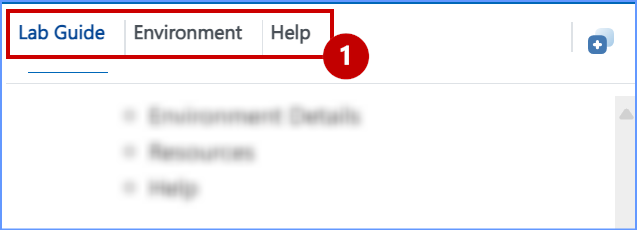
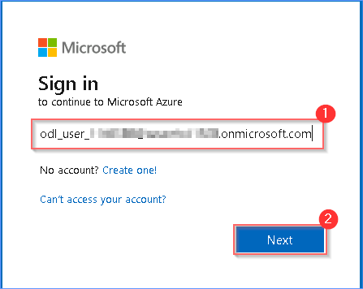

# Getting Started with Lab

1. Once the environment is provisioned, a virtual machine (JumpVM/Bastion) and lab guide will get loaded in your browser. Use this virtual machine throughout the workshop to perform the lab. 


### Know the right side of the tab, before performing the lab.

1. Lab guide tab contains all the steps you need to perform and complete the lab. You can see the number on the lab guide bottom area to switch to different exercises in the lab guide.


2. Before Getting Started with the Lab explore all the tabs.

    - Lab Guide
    - Environment Details
    - Help




3. You can also view the lab guide in a separate and full window by selecting Split Window and collapse hides the lab guide by sliding out of the right screen.


# Login to Azure Portal

1. In the JumpVM/Bastion, click on the Azure portal shortcut of the Microsoft Edge browser, which is created on the desktop.


2. If you see the popup notification to Restore pages, close it.


3. On the Sign into Microsoft Azure tab, you will see the login screen. Paste the following email/username and then click on Next.

```BASH
 <inject key= "AzureAdUserEmail" enableCopy="true"/>
```



4. Now paste the following password and click on Signin.

```BASH
 <inject key= "AzureAdUserPassword" enableCopy="true"/>
```


5. Click on **Yes**.


`Note: After getting signed in to the Azure Portal, if you see a popup "Welcome to Microsoft Azure" click on "Cancel" to skip the tour and close the window.`

6. Now you will see the Azure Portal Dashboard, Click on search bar and search for "rg-fabric-dpoc" Resource Group and select the Resource Group.


`Note: In the Resource Group there will be 8 resources.`


